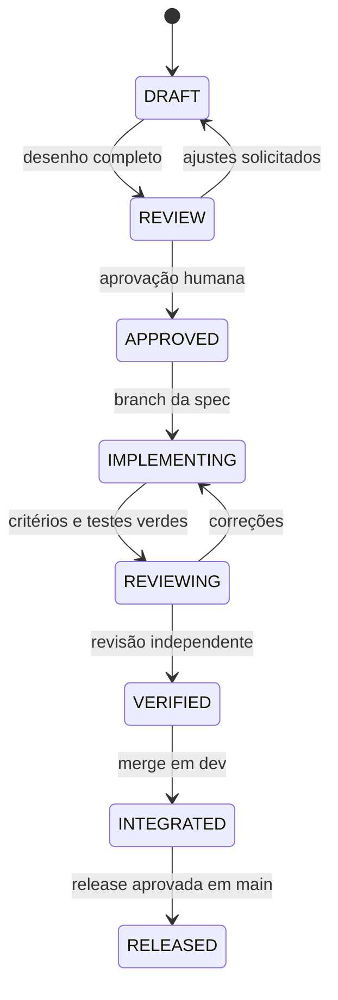

# Hubbie — documentação orientada por especificações

Esta pasta é a fonte de verdade do desenvolvimento do Hubbie. O projeto segue
Spec-Driven Development (SDD): uma mudança só entra em implementação depois que
sua especificação estiver aprovada e seus critérios de aceitação puderem ser
verificados.

## Fluxo SDD

## Regras

1. Cada spec possui identificador estável, objetivo, escopo, requisitos e
   critérios/testes próprios. Diagramas, matriz, riscos, migração e rollback
   comuns são herdados explicitamente da SPEC-000; a task documenta desvios.
2. O código deve referenciar a spec que o motivou no PR ou commit.
3. Nenhum agente pode ampliar o escopo aprovado. Dúvidas materiais voltam para
   revisão humana.
4. `main` representa produção; `dev` integra specs verificadas; cada spec usa
   uma branch curta `feat/spec-NNN-descricao` e, quando conveniente, um
   worktree isolado.
5. Contratos HTTP são descritos em OpenAPI 3.1. Eventos Socket.IO e jobs possuem
   schemas versionados.
6. MySQL é a fonte da verdade. Redis é usado para cache-aside, BullMQ e Pub/Sub,
   nunca como substituto definitivo do banco.
7. Segurança, auditoria, observabilidade e rollback fazem parte do requisito,
   não são atividades posteriores.

## Organização e catálogo

Arquitetura compartilhada:

- [SPEC-000 — arquitetura e migração](specs/SPEC-000-arquitetura-migracao.md)

Backend:

- [catálogo de tasks BE-001 a BE-012](specs/backend/README.md)

Frontend:

- [design da migração Angular](specs/frontend-migration-design.md)
- [catálogo de tasks FE-001 a FE-009](specs/frontend/README.md)
- [template para novas fatias](specs/frontend-slice-template.md)
- [spec histórica dos cortes 0–1](specs/frontend-cuts-0-1-foundation-conversations.md)

Planejamento:

- `plans/`: ordem executável, passos TDD, checkpoints e coordenação de agentes.

`SPEC-000` contém decisões transversais. Specs `BE-*` e `FE-*` são unidades de
implementação independentes, ligadas por contratos e dependências explícitas.
Decisões futuras que mudem um design aprovado devem usar `docs/adrs/`.

## Decisões arquiteturais do MVP

Para a execução do MVP, as decisões originais da `SPEC-000` foram simplificadas
conforme documentado nos ADRs abaixo. O dev/arquiteto deve ler esses documentos
antes de implementar.

- [ADR-0001 — Escopo Simplificado do MVP](adrs/0001-mvp-simplificado.md)
- [ADR-0002 — Arquitetura Macro](adrs/0002-arquitetura-macro.md)
- [ADR-0003 — Stack Tecnológica](adrs/0003-stack-tecnologica.md)
- [ADR-0004 — Autenticação e Sessão](adrs/0004-autenticacao-sessao.md)
- [ADR-0005 — Persistência e Schema](adrs/0005-persistencia-schema.md)
- [ADR-0006 — Mensageria e Filas](adrs/0006-mensageria-filas.md)
- [ADR-0007 — Processamento de Mídia](adrs/0007-processamento-midia.md)
- [ADR-0008 — Deploy e Infraestrutura](adrs/0008-deploy-infraestrutura.md)
- [ADR-0009 — Migração e Cutover](adrs/0009-migracao-cutover.md)

## Diagramas

Diagramas visuais do fluxo de mensagens, componentes do backend e decisões
arquiteturais estão indexados em [`diagrams/README.md`](diagrams/README.md).
