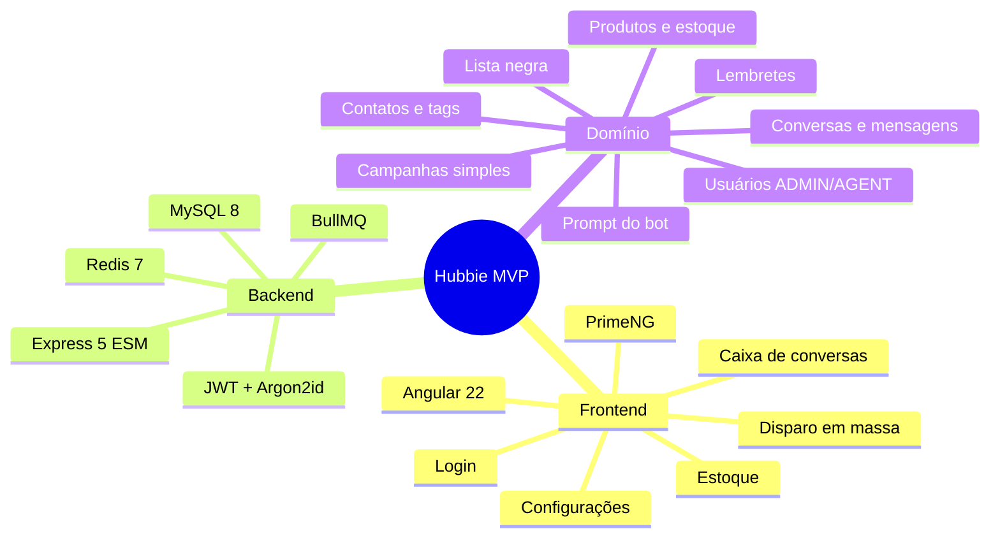

# ADR-0001 — Escopo Simplificado do MVP

- **Estado:** Aprovado
- **Data:** 2026-08-20
- **Decisores:** P.O. do Hubbie
- **Escopo:** Define o que entra e o que fica fora do MVP

## Contexto

O Hubbie nasceu como um bot Node/Express monolítico (`index.js`) com persistência em arquivos JSON e estado em memória. A arquitetura de longo prazo (`SPEC-000`) prevê uma plataforma robusta com criptografia de campos, transactional outbox, media-worker isolado, ClamAV e observabilidade avançada.

Para o **MVP inicial**, optamos por um escopo reduzido que permita entregar valor em pouco tempo, sem abrir mão da segurança mínima e da capacidade de evoluir.

## Decisão

Adotar um **MVP simplificado** com as seguintes características:

- Frontend obrigatório em **Angular 22 + PrimeNG**.
- Backend em **Express 5 + JavaScript ESM**.
- **MySQL 8** como fonte da verdade.
- **Redis 7** para sessões, rate limiting, filas e Pub/Sub.
- **BullMQ** para jobs assíncronos, sem transactional outbox.
- Autenticação com **JWT + refresh rotativo** em cookie seguro.
- Mídia processada no worker geral, sem ClamAV e sem media-worker separado.
- Dados sensíveis em texto no banco (senhas e tokens cifrados), conforme ADR-0005.

## O que está no MVP

## O que está fora do MVP

| Item | Motivo do corte | Quando voltar |
|---|---|---|
| Criptografia de campos | Complexidade alta; disco criptografado mitiga | Fase de hardening |
| Transactional outbox | Overhead para volume inicial | Volume de campanhas crescer |
| Media-worker separado | Processo extra sem necessidade imediata | Segurança de documentos exigir |
| ClamAV | Integração operacional pesada | Muitos documentos de origem desconhecida |
| Role SUPPORT | Sem operação de suporte no início | Escalar operação |
| SSR/PWA | Não agregam valor no MVP | Melhoria de UX/SEO |
| Gravação de áudio nativa | Feature secundária | Fase de usabilidade |
| Dashboard de auditoria | Sem role SUPPORT | Quando houver compliance |

## Consequências

**Positivas:**
- Menor tempo para MVP funcional.
- Menor complexidade cognitiva.
- Base sólida para evolução incremental.

**Negativas:**
- Dados de telefones, nomes e mensagens em texto no banco.
- Menor tolerância a falhas em cenários de crash durante envio.
- Menor proteção contra arquivos maliciosos desconhecidos.

## Alternativas consideradas

1. **Manter escopo completo da SPEC-000 no MVP** — rejeitada por tempo de entrega excessivo.
2. **Usar SQLite no MVP** — rejeitada para evitar migração posterior desnecessária.
3. **Não migrar frontend para Angular no MVP** — rejeitada; Angular + PrimeNG é mandatório.

## Status

Aprovado para execução.
