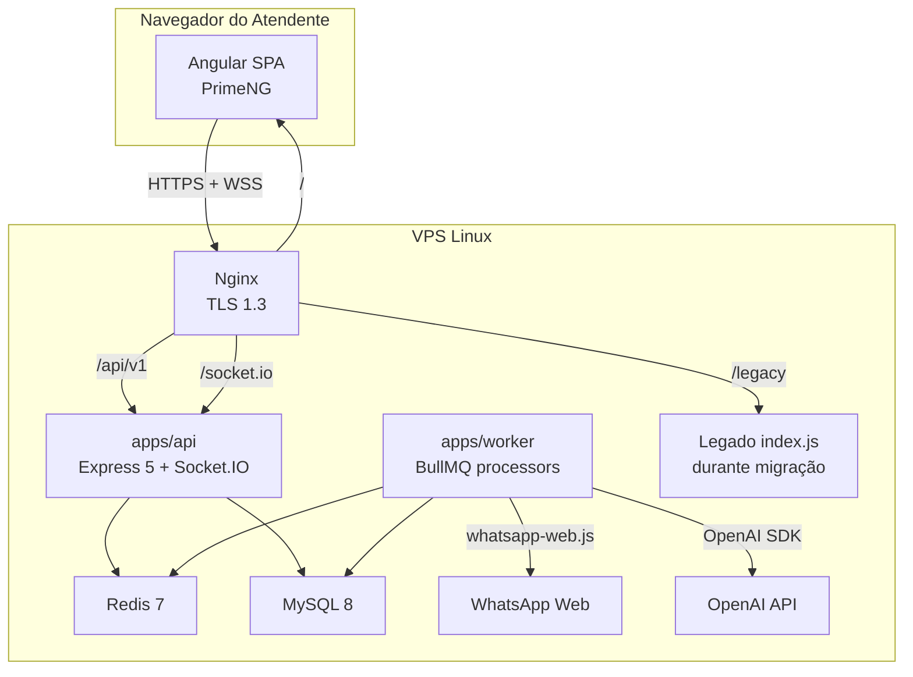

# ADR-0002 — Arquitetura Macro

- **Estado:** Aprovado
- **Data:** 2026-08-20
- **Decisores:** P.O. do Hubbie
- **Escopo:** Define a organização geral dos componentes do sistema

## Contexto

O Hubbie é um sistema single-tenant por instalação. Cada cliente possui sua própria VPS, banco, Redis e sessão WhatsApp. O time é enxuto e o produto precisa evoluir rapidamente sem operação complexa.

## Decisão

Adotar **monólito modular MVC** com processos separados apenas por necessidade operacional:

- `apps/api` — API HTTP REST e gateway Socket.IO.
- `apps/worker` — Workers BullMQ (WhatsApp, IA, campanhas, lembretes, mídia).
- `apps/web` — SPA Angular + PrimeNG.
- `packages/database` — DataSource, entities e migrations TypeORM.
- `packages/shared` — Config, logger, segurança e utilitários.



## Padrão por módulo

Cada módulo do backend segue a estrutura:

```text
modules/{dominio}/
  {dominio}.routes.js
  {dominio}.controller.js
  {dominio}.service.js
  {dominio}.repository.js
  {dominio}.schemas.js
```

## Responsabilidades

| Camada | Responsabilidade |
|---|---|
| Routes | Compor middlewares e mapear endpoints |
| Controller | Receber request, validar schema, formatar response |
| Service | Regras de negócio e transações |
| Repository | Consultas SQL/TypeORM |

## Decisões relacionadas

- Não usamos microserviços — ver ADR-0001.
- Não usamos NestJS — ver ADR-0003.
- Não usamos TypeScript no backend — ver ADR-0003.

## Consequências

**Positivas:**
- Simplicidade de desenvolvimento e deploy.
- Transações ACID dentro de um mesmo banco.
- Fácil depuração e testes.

**Negativas:**
- Escalabilidade horizontal limitada.
- Risco de acoplamento se módulos não respeitarem fronteiras.
