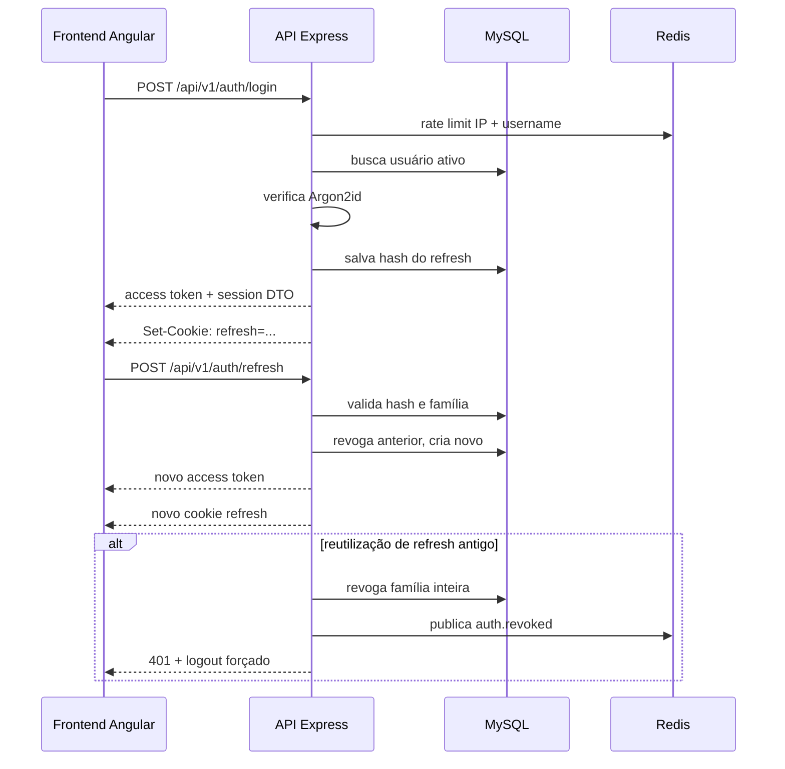

# ADR-0004 — Autenticação e Sessão

- **Estado:** Aprovado
- **Data:** 2026-08-20
- **Decisores:** P.O. do Hubbie
- **Escopo:** Define como usuários se autenticam e mantêm sessão

## Contexto

O sistema terá dois papéis no MVP: `ADMIN` e `AGENT`. O `ADMIN` gerencia usuários, configurações e estoque. O `AGENT` atende conversas e cria campanhas.

O legado usa autenticação com credenciais fixas no código. Isso é inaceitável na nova arquitetura.

## Decisão

Usar **JWT de curta duração** (20 minutos) com **refresh token rotativo** armazenado em cookie `HttpOnly`, `Secure`, `SameSite=Strict`.

## Detalhes

### Access Token

- Algoritmo: **RS256**.
- Duração: **20 minutos**.
- Claims: `sub`, `role`, `authVersion`, `jti`, `iss`, `aud`, `iat`, `exp`.
- Armazenamento: apenas na memória do frontend.

### Refresh Token

- Token opaco e aleatório.
- Hash armazenado no MySQL.
- Valor apenas no cookie.
- Rotacionado a cada uso.
- Reutilização de token antigo revoga toda a família.

### Bootstrap do ADMIN

1. Migration cria schema.
2. Seed idempotente cria primeiro `ADMIN` com senha temporária vinda de variável de ambiente.
3. Usuário nasce com `must_change_credentials=true`.
4. Até trocar username/senha, somente rotas de sessão e troca são aceitas.

### RBAC no MVP

| Papel | Permissões |
|---|---|
| `ADMIN` | Usuários, configurações, estoque, conversas, campanhas, WhatsApp, exclusão |
| `AGENT` | Conversas, mensagens, lembretes, campanhas, bloqueio/desbloqueio de contatos |

### Rate Limiting Inicial

| Operação | Limite |
|---|---|
| Login | 5 tentativas / 15 min por IP + username |
| Refresh | 10 / min por sessão |
| API geral | 120 / min por usuário |

## Consequências

**Positivas:**
- Segurança superior ao legado.
- Revogação granular por família de refresh.
- Compatível com futura evolução para MFA.

**Negativas:**
- Maior complexidade que sessão simples.
- Refresh rotativo exige cuidado com race conditions.
