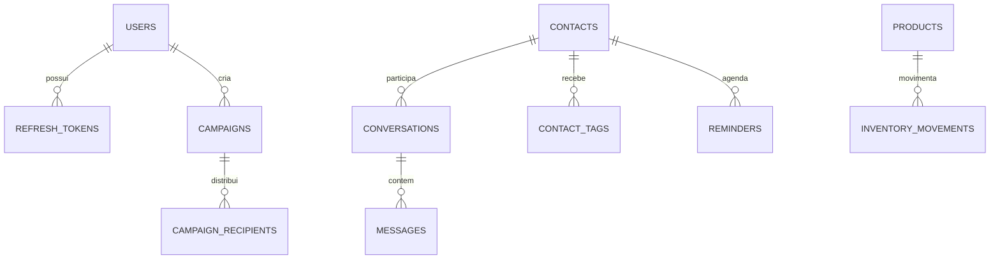

# ADR-0005 — Persistência e Schema

- **Estado:** Aprovado
- **Data:** 2026-08-20
- **Decisores:** P.O. do Hubbie
- **Escopo:** Define como os dados são armazenados no MVP

## Contexto

O legado armazena dados em arquivos JSON (`estoque.json`, `tags.json`, `config.json`, etc.) e estado em memória. Isso causa perda de dados em reinícios e dificulta concorrência.

## Decisão

Usar **MySQL 8** como fonte da verdade, com **TypeORM EntitySchema** em JavaScript e **migrations explícitas**.

No MVP, **não aplicamos criptografia de campos**. Telefones, nomes, mensagens e prompts ficam em texto no banco. Apenas senhas (Argon2id) e tokens de refresh são cifrados/hasheados.

## Tabelas principais

| Tabela | Responsabilidade |
|---|---|
| `users` | ADMIN/AGENT, senha, role, auth_version |
| `refresh_tokens` | Família de refresh tokens |
| `contacts` | Contatos WhatsApp, estado da IA, bloqueio |
| `contact_tags` | Tags e cores por contato |
| `conversations` | Conversas, arquivamento |
| `messages` | Mensagens inbound/outbound |
| `products` | Produtos do estoque |
| `inventory_movements` | Movimentações de entrada/saída |
| `reminders` | Lembretes agendados |
| `campaigns` | Campanhas de disparo |
| `campaign_recipients` | Destinatários das campanhas |
| `app_config` | Configurações da aplicação, prompt |

## IDs e timestamps

- IDs: **UUID v7**.
- Timestamps: **UTC**.
- Collation: `utf8mb4_0900_ai_ci`.

## Por que não criptografar campos no MVP

A criptografia de campos (AES-256-GCM) com blind indexes aumenta significativamente:
- Complexidade das entities TypeORM.
- Complexidade das queries.
- Tempo de desenvolvimento.
- Risco de bugs de busca.

**Mitigações adotadas:**
- Servidor usa disco criptografado (LUKS).
- Acesso SSH apenas por chave.
- Firewall restritivo.
- Usuários Linux isolados por serviço.
- Logs sanitizados.

## Consequências

**Positivas:**
- Desenvolvimento mais rápido.
- Queries simples e diretas.
- Debugging mais fácil.

**Negativas:**
- Em caso de comprometimento total do servidor, dados ficam expostos.
- Será necessário migrar para criptografia de campos em fase posterior.

## Evolução planejada

| Fase | Ação |
|---|---|
| MVP | Texto no banco, senhas/token hasheados |
| Fase 2 | Criptografia de telefones, nomes, mensagens e prompts |
