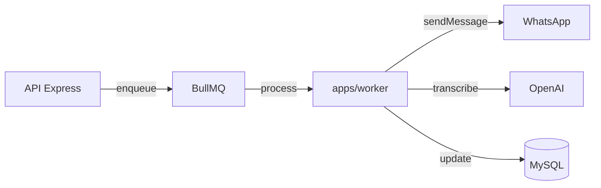
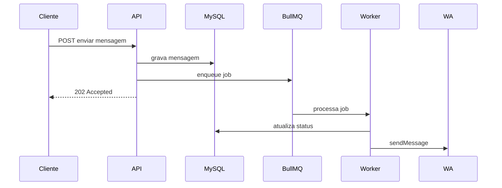

# ADR-0006 — Mensageria e Filas

- **Estado:** Aprovado
- **Data:** 2026-08-20
- **Decisores:** P.O. do Hubbie
- **Escopo:** Define como jobs assíncronos são processados

## Contexto

O Hubbie precisa executar ações fora do ciclo de request HTTP: enviar mensagens WhatsApp, processar campanhas, executar lembretes, transcrever áudio e gerar respostas de IA.

## Decisão

Usar **BullMQ** diretamente, **sem transactional outbox** no MVP.

## Filas do MVP

| Fila | Responsabilidade |
|---|---|
| `outbound` | Envio de mensagens WhatsApp |
| `automation` | Respostas automáticas da IA |
| `bulk-dispatch` | Disparo de campanhas |
| `reminders` | Lembretes agendados |
| `media` | Processamento de mídia |

## Idempotência

- Cada job usa `jobId` determinístico quando possível.
- Operações críticas usam `operationId` / `Idempotency-Key`.
- Retry configurado com backoff exponencial.
- Falhas ambíguas vão para DLQ manual.

## Sem transactional outbox

No MVP, a API grava no MySQL e enfileira no BullMQ na mesma operação lógica, sem uma tabela de outbox separada.

**Por que não outbox:**
- Reduz complexidade de desenvolvimento.
- Volume inicial é baixo.
- Perda/duplicação ocasional é aceitável no MVP.

## Consequências

**Positivas:**
- Menos código.
- Menos tabelas.
- Ciclo de desenvolvimento mais curto.

**Negativas:**
- Pequeno risco de perda ou duplicação se o processo cair no momento exato entre gravação e enqueue.
- Menor rastreabilidade de eventos.

## Evolução planejada

| Fase | Ação |
|---|---|
| MVP | BullMQ direto |
| Fase 3 | Transactional outbox para campanhas e lembretes |
