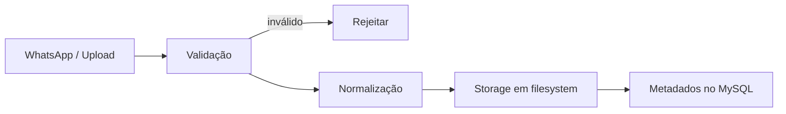

# ADR-0007 — Processamento de Mídia

- **Estado:** Aprovado
- **Data:** 2026-08-20
- **Decisores:** P.O. do Hubbie
- **Escopo:** Define como imagens, áudios e documentos são recebidos e enviados

## Contexto

O sistema recebe mídia via WhatsApp e via upload no painel. É necessário validar, normalizar e armazenar esses arquivos de forma segura.

## Decisão

Processar mídia no **worker geral**, sem processo isolado e sem ClamAV no MVP.

## Validação

- Magic bytes + extensão + MIME devem concordar.
- Tamanho máximo por tipo.
- Rejeitar scripts, executáveis, HTML, SVG, XML, ZIP, macros.
- Rejeitar extensões duplas.

## Formatos permitidos no MVP

| Tipo | Formatos | Limite |
|---|---|---|
| Imagem | JPEG, PNG, WebP | 10 MB |
| Áudio | OGG, MP3, WAV, M4A | 20 MB |
| Documento | PDF, TXT | 20 MB |

## Normalização

- Imagens: recodificar com Sharp, remover EXIF.
- Áudio: transcodificar com FFmpeg para formato padrão.
- PDF: rejeitar JavaScript, launch actions, formulários, senha.

## Armazenamento

- Filesystem privado em `/var/lib/hubbie/media/`.
- Permissões restritas (`0640`, usuário dedicado).
- Nome interno UUID; nome original usado apenas como metadado sanitizado.
- Download apenas por controller autenticado e autorizado.

## Por que sem ClamAV e media-worker separado

- Integração com ClamAV adiciona dependência operacional.
- Media-worker separado exige IPC, filesystem compartilhado e sandbox complexo.
- No MVP, a allowlist rígida + recodificação forçada oferece proteção suficiente.

## Consequências

**Positivas:**
- Menos componentes.
- Menor complexidade de deploy.
- Rápido de implementar.

**Negativas:**
- Menor proteção contra ameaças desconhecidas.
- Bug no parser de mídia pode afetar o worker geral.

## Evolução planejada

| Fase | Ação |
|---|---|
| MVP | Validação + normalização no worker geral |
| Fase 4 | Media-worker isolado + ClamAV + sandbox |
