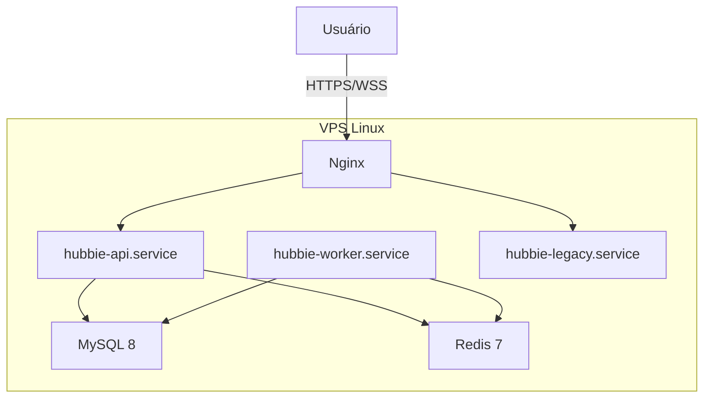
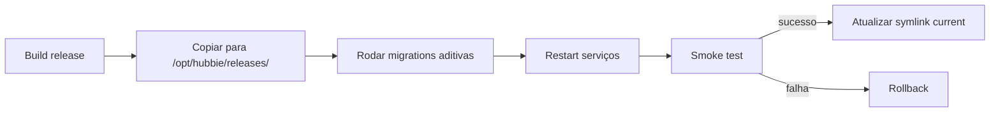

# ADR-0008 — Deploy e Infraestrutura

- **Estado:** Aprovado
- **Data:** 2026-08-20
- **Decisores:** P.O. do Hubbie
- **Escopo:** Define como o sistema é hospedado e atualizado

## Contexto

Cada instalação do Hubbie é single-tenant. O cliente contrata uma VPS Linux e o sistema é instalado nela.

## Decisão

Usar **VPS Linux sem Docker**, com deploy manual/orquestrado por scripts e serviços systemd.



## Estrutura de diretórios

```text
/opt/hubbie/releases/<commit>/
/opt/hubbie/current -> releases/<commit>
/etc/hubbie/credentials/
/var/lib/hubbie/whatsapp/
/var/lib/hubbie/media/
/var/log/hubbie/
```

## Serviços systemd

| Serviço | Responsabilidade |
|---|---|
| `hubbie-api.service` | API HTTP + Socket.IO |
| `hubbie-worker.service` | Processadores BullMQ + WhatsApp |
| `hubbie-legacy.service` | Legado index.js durante migração |

## Hardening básico

- Nginx é o único processo público.
- MySQL e Redis escutam apenas loopback/socket Unix.
- Cada serviço usa usuário Linux próprio.
- `UMask=0077`, `NoNewPrivileges`, `PrivateTmp`.
- SSH apenas por chave, root desativado.
- Firewall restritivo.
- Discos criptografados com LUKS.

## Processo de release



## Por que sem Docker

- Menor overhead.
- Simplicidade operacional para time enxuto.
- Maior controle sobre usuários, permissões e hardening.

## Consequências

**Positivas:**
- Deploy enxuto.
- Baixo consumo de recursos.
- Fácil de inspecionar e debugar.

**Negativas:**
- Menor isolamento entre serviços.
- Reprodução de ambiente mais difícil.
- Dependência de scripts de deploy bem testados.
