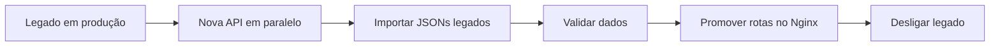
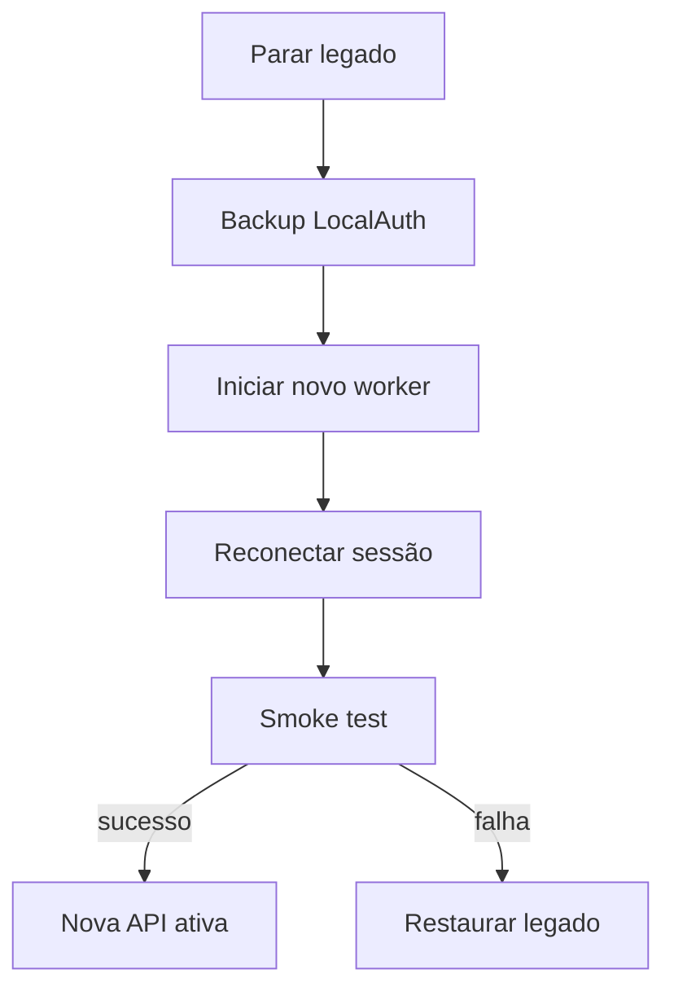

# ADR-0009 — Migração e Cutover

- **Estado:** Aprovado
- **Data:** 2026-08-20
- **Decisores:** P.O. do Hubbie
- **Escopo:** Define como migramos do legado para a nova arquitetura

## Contexto

O sistema legado (`index.js`) continua atendendo em produção. A nova arquitetura será construída em paralelo e promovida gradualmente.

## Decisão

Usar **Strangler Fig** com importação one-shot dos dados legados.

## Fases do cutover

1. **Construção:** nova API e worker são desenvolvidos em branch `dev`.
2. **Importação one-shot:** os 6 JSONs legados são importados para o MySQL com backup prévio.
3. **Validação:** P.O. e time validam paridade de dados e comportamento.
4. **Promoção:** Nginx passa a rotear `/` para o Angular e `/api/v1` para a nova API.
5. **Observação:** legado fica disponível em `/legacy` por segurança.
6. **Retirada:** após janela de observação, removemos `index.js`, `index.html`, `login.html` e JSONs.

## Mapeamento dos JSONs

| JSON Legado | Tabela MySQL |
|---|---|
| `estoque.json` | `products` |
| `config.json` | `app_config` |
| `tags.json` + `cores.json` | `contacts` + `contact_tags` |
| `fixados.json` | preferência inicial do ADMIN |
| `arquivadas.json` | `conversations.archived_at` |
| lista negra em RAM | `contacts.blocked` |
| IA pausada em RAM | `contacts.ai_paused` |
| lembretes em RAM | `reminders` |
| histórico em RAM | `messages` |

## Importação one-shot

- Backup completo dos JSONs e do banco antes da importação.
- Validação com JSON Schema.
- Conversão de preços pt-BR para decimal.
- Normalização de telefones.
- Não apagar os JSONs originais até a retirada final do legado.

## Cutover do WhatsApp

O corte do WhatsApp exige uma breve reconexão controlada. Apenas um processo pode possuir o `LocalAuth` por vez.

## Consequências

**Positivas:**
- Baixo risco de indisponibilidade.
- Rollback rápido durante a fase de observação.
- Validação de paridade antes da promoção.

**Negativas:**
- Período de dupla manutenção.
- Complexidade temporária de roteamento no Nginx.
- Reconexão WhatsApp pode causar instabilidade breve.

## Critérios para retirada do legado

- [ ] Todas as rotas do MVP funcionando na nova API.
- [ ] Dados importados validados.
- [ ] Smoke test aprovado.
- [ ] Janela de observação concluída sem incidentes.
- [ ] Backup testado e restaurável.
