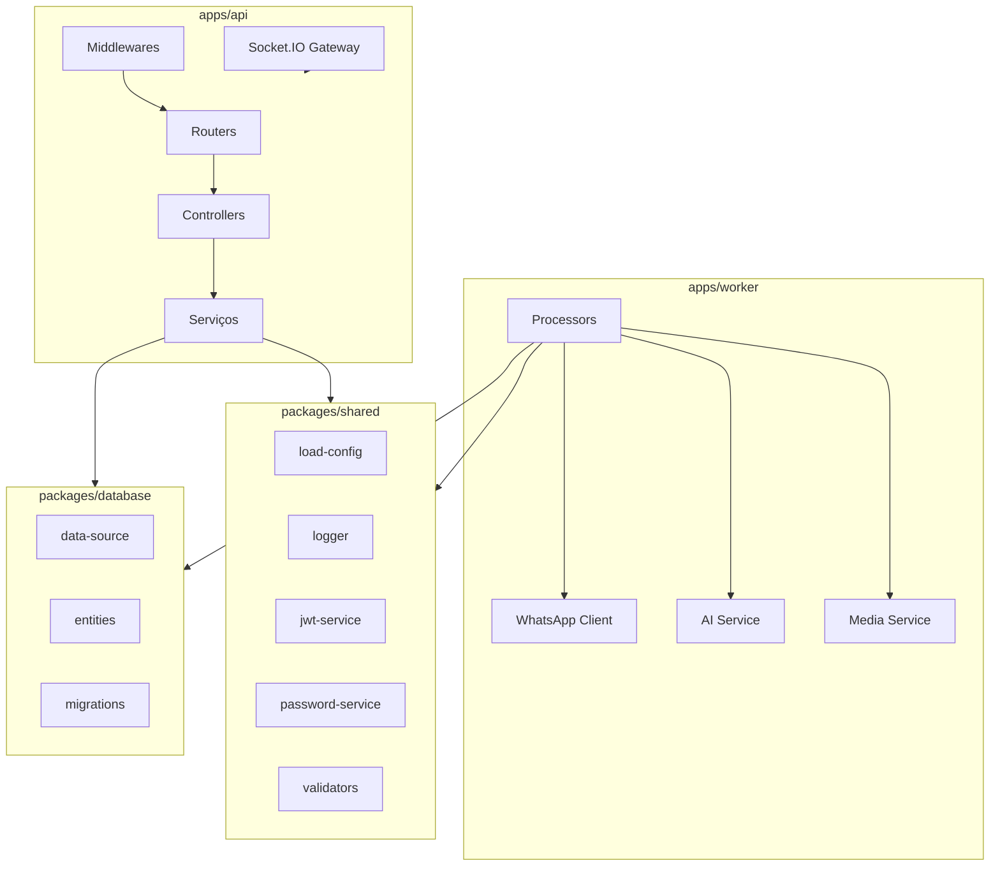

# Diagrama: Componentes do Backend

## Responsabilidades dos componentes

| Componente | Responsabilidade |
|---|---|
| `Routers` | Mapear rotas HTTP e compor middlewares |
| `Controllers` | Receber request, chamar service, formatar response |
| `Services` | Regras de negócio e transações |
| `Repositories` | Consultas e persistência (embutido nos services no MVP) |
| `Middlewares` | Auth, rate limit, requestId, validação, erro |
| `Socket.IO Gateway` | Push de eventos para o frontend |
| `Processors` | Consumers BullMQ |
| `WhatsApp Client` | Integração com whatsapp-web.js |
| `AI Service` | Integração com OpenAI |
| `Media Service` | Validação e normalização de arquivos |
| `load-config` | Carregar e validar configurações |
| `logger` | Logs JSON redigidos |
| `jwt-service` | Emitir e verificar JWT |
| `password-service` | Hash e verificação com Argon2id |
| `data-source` | Conexão TypeORM |
| `entities` | EntitySchemas |
| `migrations` | Alterações versionadas do schema |

## Regras de dependência

- `Controllers` dependem de `Services`.
- `Services` dependem de `packages/database` e `packages/shared`.
- `Processors` dependem de `Services` e `packages/shared`.
- Nenhum componente de domínio depende diretamente de outro domínio; a comunicação passa por services.
