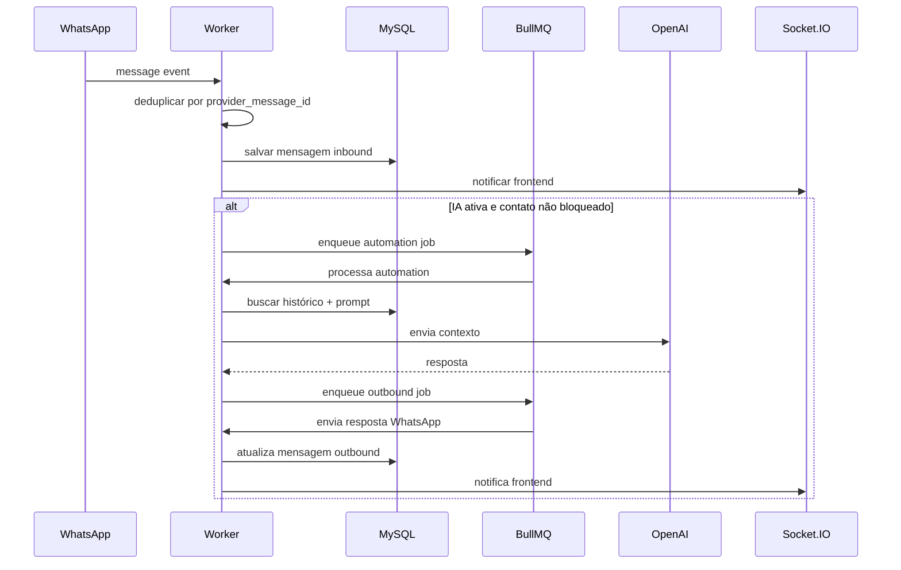
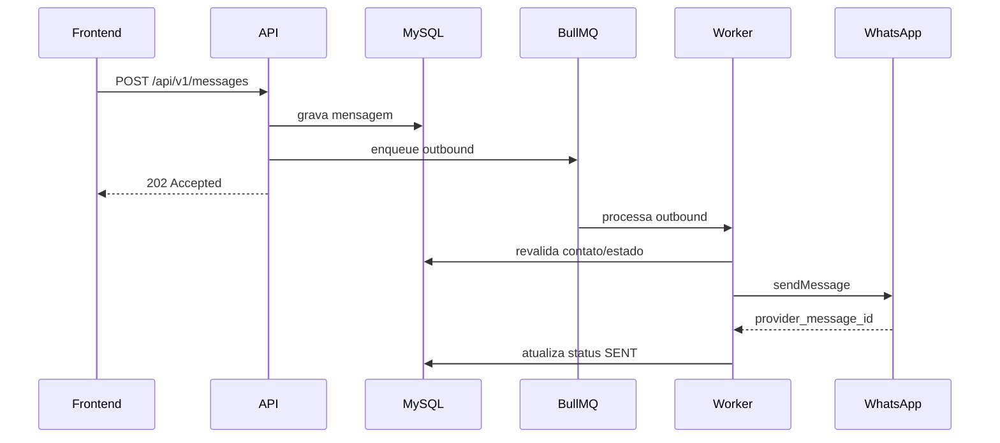
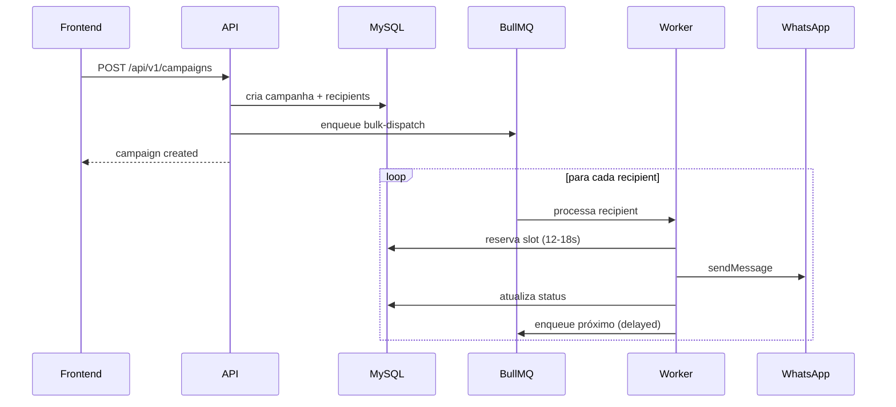
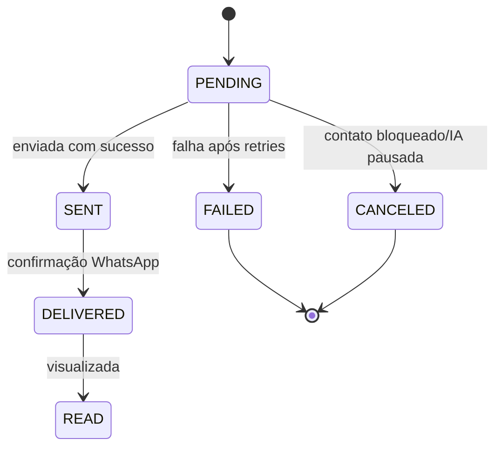

# Diagrama: Fluxo de Mensagens

Este diagrama ilustra o fluxo completo de uma mensagem no Hubbie, desde o recebimento pelo WhatsApp até a resposta ao cliente.

## Inbound (mensagem do cliente)

## Outbound (mensagem do atendente ou bot)

## Campanha (disparo em massa)

## Estados de uma mensagem

