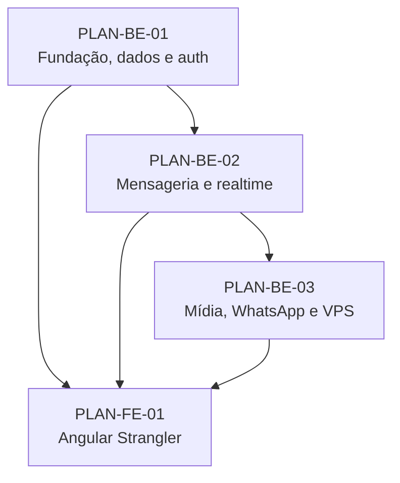

# Planos de implementação

Estes planos traduzem as specs aprovadas/draft em uma ordem executável. Eles
não autorizam implementação por si só: antes de iniciar uma task, sua spec deve
estar `APPROVED`.

## Ordem

| Plano | Specs | Documento |
|---|---|---|
| PLAN-BE-01 | BE-001..BE-005 | [Fundação, dados e autenticação](backend/2026-08-12-fundacao-dados-auth.md) |
| PLAN-BE-02 | BE-006..BE-009 | [Mensageria, realtime e campanhas](backend/2026-08-12-mensageria-realtime.md) |
| PLAN-BE-03 | BE-010..BE-012 | [Mídia, WhatsApp e cutover](backend/2026-08-12-midia-whatsapp-cutover.md) |
| PLAN-FE-01 | FE-001..FE-009 | [Angular Strangler](frontend/2026-08-12-angular-strangler.md) |

## Protocolo obrigatório por task

1. Criar branch/worktree `feat/<spec>-descricao` a partir de `dev`.
2. Confirmar que a spec está `APPROVED` e registrar seu hash/commit.
3. Escrever um teste pequeno que expresse o próximo comportamento.
4. Executá-lo e guardar a falha esperada (Red).
5. Escrever apenas o código suficiente para passar (Green).
6. Rodar teste focal, suite do workspace, lint e checks de segurança.
7. Refatorar sem mudar comportamento e rodar novamente.
8. Commitar uma unidade coerente referenciando a spec.
9. Solicitar revisão de conformidade da spec e depois revisão de qualidade.
10. Integrar em `dev` somente com as duas revisões e gates verdes.

Nenhum agente recebe autorização para fazer deploy, promover feature flag,
alterar `main` ou avançar para a próxima spec sem checkpoint humano.
