# SPEC-000 — Arquitetura e migração do Hubbie

- **Estado:** APPROVED
- **Data:** 2026-08-12
- **Branch base:** `dev`
- **Abordagem:** Strangler Fig
- **Arquitetura:** monólito modular MVC
- **Backend:** Node.js LTS, JavaScript ESM, Express 5
- **View:** HTML/CSS/JS legado durante a migração; Angular em fase posterior
- **Persistência:** MySQL 8
- **Cache, filas e tempo real:** Redis 7, BullMQ e Socket.IO Redis Adapter
- **Hospedagem:** VPS Linux, sem Docker, implantação por SSH

## 1. Contexto

O Hubbie automatiza atendimento e disparo de mensagens de uma única sessão do
WhatsApp por instalação. Cada cliente possui sua própria hospedagem e seus
próprios MySQL e Redis. A instalação é single-tenant e admite exatamente um
`ADMIN` ativo, vários `AGENT`s e usuários `SUPPORT`.

O legado é um processo Node/Express único com Socket.IO, `whatsapp-web.js` e
OpenAI. Estoque, configurações, tags, cores, contatos fixados e conversas
arquivadas estão em arquivos JSON. Bloqueios, pausas de IA, lembretes, histórico
e estado global vivem em RAM.

Riscos críticos do legado incluem credenciais fixas, segredo de sessão no
código, Socket.IO com CORS aberto e sem autorização por evento, comandos
administrativos recebidos pelo WhatsApp, arquivos sem validação robusta,
Chromium sem sandbox e conteúdo inserido com `innerHTML`.

## 2. Objetivos

1. Migrar toda persistência JSON e RAM para MySQL sem indisponibilizar o legado.
2. Modernizar o backend para Express 5 em JavaScript ESM, mantendo MVC simples,
   SOLID pragmático e módulos pequenos.
3. Aplicar Zero Trust em REST, Socket.IO, jobs, mídia e acesso aos dados.
4. Preservar ordenação de mensagens, garantir resiliência a reinícios e prover
   disparos com intervalo aleatório de 12 a 18 segundos.
5. Manter mensagens e mídias no histórico até exclusão explícita via API.
6. Usar cache-aside sem transformar Redis em fonte da verdade.
7. Preparar contratos estáveis para a View Angular na última fase.

## 3. Fora do escopo do MVP

- Cobrança, assinatura ou licenciamento mensal.
- OAuth/OIDC e login social.
- MFA/TOTP.
- RabbitMQ, Kafka, microserviços, CQRS, event sourcing e arquitetura hexagonal.
- Vários números ou várias sessões WhatsApp na mesma instalação.
- API oficial do WhatsApp; a integração permanece em `whatsapp-web.js` no MVP.
- Angular antes da estabilização e retirada do backend legado.
- E2EE no nível da aplicação; o transporte usa WSS/TLS 1.3.

## 4. Princípios arquiteturais

- Monólito modular MVC com processos separados apenas por isolamento
  operacional: API, worker geral e worker de mídia.
- Controllers recebem e formatam HTTP; Services contêm regras e transações;
  Repositories concentram consultas TypeORM; Routers compõem middlewares.
- Interfaces são criadas somente quando houver mais de uma implementação real.
- OpenAPI 3.1 é o contrato HTTP; JSON Schema valida entradas em runtime.
- MySQL é autoritativo. Redis pode ser perdido e reconstruído sem alterar o
  resultado funcional.
- Operações críticas são idempotentes e auditáveis.
- Nenhum dado sensível é registrado em logs operacionais ou payloads de jobs.

## 5. Arquitetura macro

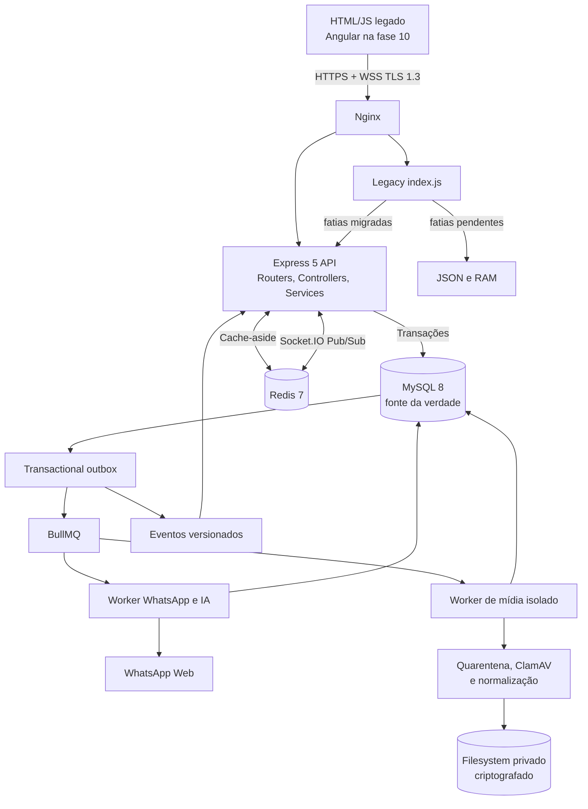

### 5.1 Estrutura do monorepo

```text
apps/
  api/
    src/
      config/
      middlewares/
      modules/
        auth/
        users/
        contacts/
        conversations/
        messages/
        inventory/
        campaigns/
        reminders/
        settings/
        whatsapp/
        media/
        audit/
        health/
      realtime/
      app.js
      server.js
  worker/
    src/processors/
  media-worker/
    src/processors/
  web/                  # Angular em SPEC-010
packages/
  database/             # entities, migrations e conexão
  contracts/            # OpenAPI, JSON Schemas e eventos
  shared/               # criptografia, logging e utilitários pequenos
docs/
```

Cada módulo segue uma forma simples:

```text
campaigns/
  campaigns.routes.js
  campaigns.controller.js
  campaigns.service.js
  campaigns.repository.js
  campaigns.schemas.js
  campaign.entity.js
  campaign-recipient.entity.js
```

## 6. Migração Strangler Fig

O legado continua disponível durante a migração. Cada fatia substitui seus
handlers de armazenamento por chamadas à nova API. O espelhamento de escrita é
temporário e idempotente, usado somente quando necessário para rollback.

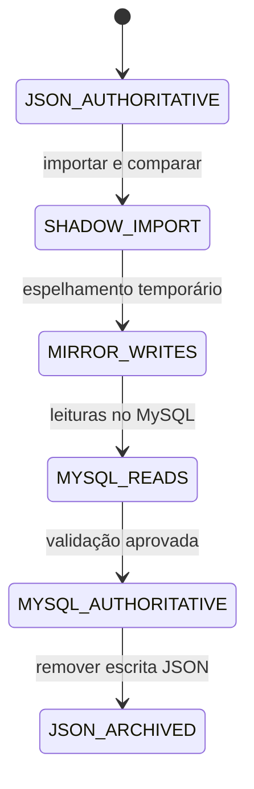

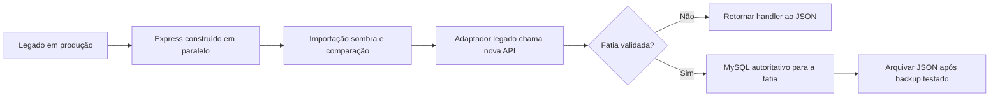

Ordem das fatias:

1. Fundação Express, MySQL, Redis, segurança e auditoria.
2. Estoque, configurações, tags, fixados e arquivados.
3. Usuários, JWT, refresh token e permissões.
4. Contatos, bloqueios, conversas e mensagens.
5. Lembretes, campanhas e BullMQ.
6. Mídia segura e OpenAI.
7. Worker WhatsApp.
8. Cutover e retirada do legado.
9. Angular.

O corte da sessão do WhatsApp exige uma breve reconexão controlada. Dois clientes
não podem possuir o mesmo `LocalAuth` simultaneamente.

## 7. Modelo de dados

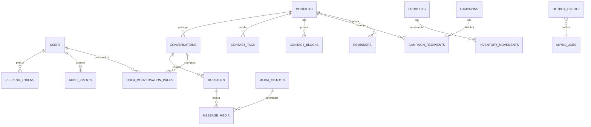

### 7.1 Tabelas centrais

- `users`: papel, estado, `auth_version`, username e hash Argon2id.
- `refresh_tokens`: família, hash, dispositivo, expiração, rotação e revogação.
- `contacts`: IDs WhatsApp/telefone criptografados, blind indexes e estado da IA.
- `contact_tags`: tag e cor por contato, preservando a semântica atual.
- `contact_blocks`: histórico de bloqueio/desbloqueio por `AGENT` ou `ADMIN`.
- `conversations`: contato, estado, `automation_epoch` e sequência transacional.
- `user_conversation_preferences`: contatos fixados por usuário.
- `messages`: direção, autor, tipo, status, corpo cifrado, sequências e ID do
  provedor.
- `media_objects` e `message_media`: arquivo, integridade, estado e mensagem.
- `products`: código, nome, preço decimal, saldo, mínimo e validade opcional.
- `inventory_movements`: ledger de entrada, venda, ajuste e saldo de abertura.
- `campaigns` e `campaign_recipients`: estado e progresso individual.
- `reminders`: agendamento UTC, estado, tentativas e resultado.
- `app_config`: prompt cifrado, IA global, timezone, instalação e versão.
- `whatsapp_sessions`: máquina de estados e heartbeat; não guarda `LocalAuth`.
- `audit_events`: trilha append-only e sanitizada.
- `async_jobs`, `task_outbox`, `domain_event_outbox` e `idempotency_keys`:
  confiabilidade. Não existe uma terceira tabela genérica `outbox_events`.
- `legacy_import_runs` e `legacy_import_items`: importações idempotentes.

### 7.2 Correspondência do legado

| Origem | Destino |
|---|---|
| `estoque.json` | `products` + `OPENING_BALANCE` |
| `config.json` | `app_config` |
| `tags.json` + `cores.json` | `contacts` + `contact_tags` |
| `fixados.json` | preferência inicial do `ADMIN` |
| `arquivadas.json` | `conversations.archived_at` |
| lista negra em RAM | `contact_blocks` |
| IA pausada em RAM | `contacts.ai_paused` / `automation_epoch` |
| lembretes em RAM | `reminders` |
| histórico em RAM | `conversations` + `messages` |
| estado global em RAM | `app_config.ai_enabled` |

Estados existentes somente em RAM exigem exportação temporária do processo
legado na janela da respectiva fatia. Se já tiverem sido perdidos por reinício,
não podem ser reconstruídos pelos JSONs.

### 7.3 Integridade e concorrência

- IDs são UUIDv7 ou ULID; `Date.now()` não é identidade.
- Mutações críticas exigem `Idempotency-Key`/`operationId`.
- Estoque usa transação, lock pessimista, constraint de saldo e movimento.
- Edições administrativas usam versão otimista e retornam `409` em conflito.
- Tags usam chave composta e upsert idempotente.
- Comandos expressam estado (`setPaused(true)`), nunca apenas `toggle`.
- Entrada WhatsApp é deduplicada por `provider_message_id`.
- Auditoria e outbox entram na mesma transação do domínio.
- Efeito externo é `at-least-once`; resultado ambíguo fica `UNKNOWN` e exige
  reconciliação, sem reenvio automático.

`async_jobs` é o estado durável da execução. Cada job possui exatamente uma
linha em `task_outbox`, ligada por FK e `UNIQUE(async_job_id)`; o relay publica
no BullMQ com `jobId=async_job.id`. `domain_event_outbox` é independente de jobs
e publica fatos confirmados para realtime, com `event_id` único e
`UNIQUE(aggregate_type, aggregate_id, aggregate_version)`. Relays marcam a linha
como publicada somente depois do aceite do destino e podem repetir com
idempotência.

### 7.4 Importador idempotente

1. Criar snapshot imutável dos seis JSONs e hashes SHA-256.
2. Validar schemas, códigos, tipos, preços pt-BR, datas, cores e IDs.
3. Adquirir lock exclusivo de importação.
4. Registrar manifesto único em `legacy_import_runs`.
5. Importar toda a fatia numa transação e registrar hashes por item.
6. Executar novamente o mesmo manifesto como no-op.
7. Não interpretar ausência no JSON como exclusão.
8. Não sobrescrever silenciosamente dados alterados depois do primeiro import.
9. Comparar contagens e checksums antes da promoção.
10. Manter os originais até backup e restauração terem sido testados.

## 8. Criptografia e segredos

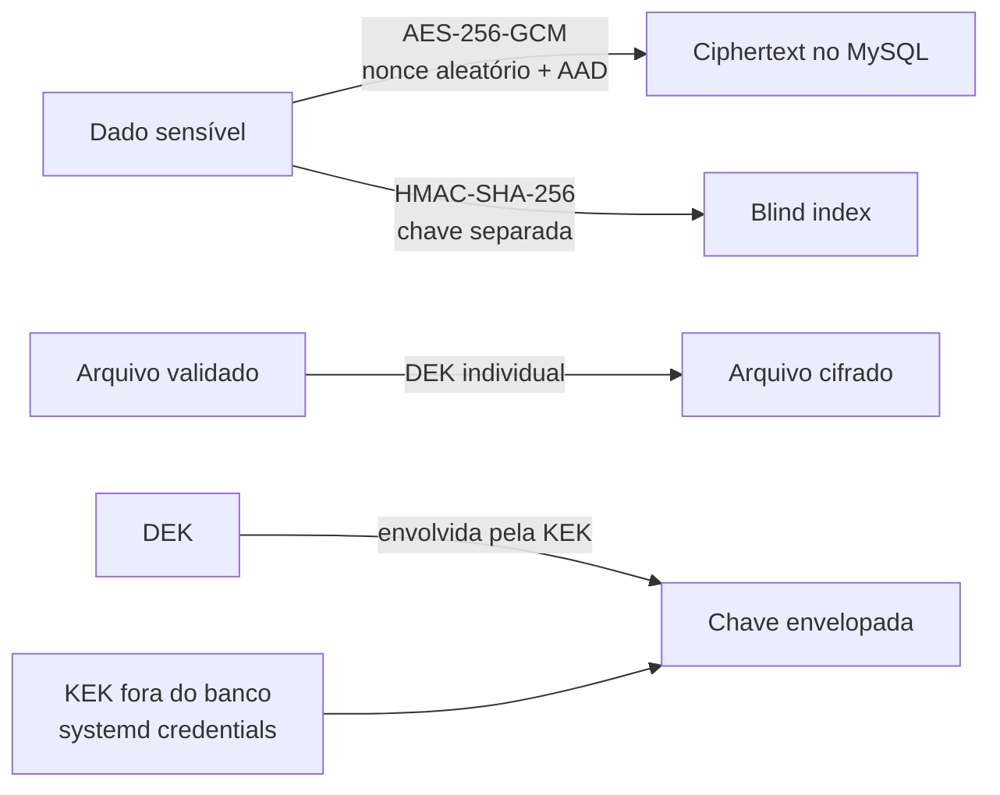

- Corpos, prompts, transcrições, nomes e telefones usam AES-256-GCM.
- Busca exata usa HMAC-SHA-256 de valor canonicalizado e chave separada.
- AAD inclui instalação, tabela, coluna e ID do registro.
- Cada registro guarda `key_version` para rotação.
- Senhas usam Argon2id calibrado na VPS, nunca criptografia reversível.
- Mídia usa uma DEK aleatória por objeto; a KEK fica fora do banco.
- Segredos são carregados de `/etc/hubbie/credentials/` com modo `0600` ou
  `systemd-creds`, nunca do repositório ou frontend.
- Redis usa loopback, ACL e credenciais mínimas; valores sensíveis são cifrados.
- `LocalAuth` é segredo crítico em diretório exclusivo e backup cifrado.

## 9. Autenticação e autorização

### 9.1 Papéis

| Papel | Capacidades |
|---|---|
| `ADMIN` | usuários, configurações, estoque, conversas, campanhas, WhatsApp, exclusão e auditoria |
| `AGENT` | conversas, mensagens, lembretes, campanhas, bloqueio/desbloqueio de contatos e exclusão |
| `SUPPORT` | saúde, métricas, filas e logs sanitizados; nenhum conteúdo |

Permissões são explícitas (`conversation.read`, `message.send`, `media.read`,
`contact.block`, `campaign.create`) e verificadas no servidor. O frontend nunca
é a barreira de segurança.

No MVP, o `ADMIN` gerencia somente contas `AGENT` e `SUPPORT`; a API não cria um
segundo administrador. Substituição do administrador requer especificação e
operação controlada próprias.

### 9.2 Bootstrap do primeiro ADMIN

1. Migration cria o schema, mas não contém credencial fixa.
2. Seed idempotente cria o primeiro `ADMIN` usando credencial temporária e
   aleatória obtida de `/etc/hubbie/credentials/`.
3. O usuário nasce com `must_change_credentials=true`.
4. Até trocar username e senha, somente as rotas de sessão e troca são aceitas.
5. A troca incrementa `auth_version`, revoga tokens e remove a credencial
   temporária.

### 9.3 JWT, refresh e sessão do frontend

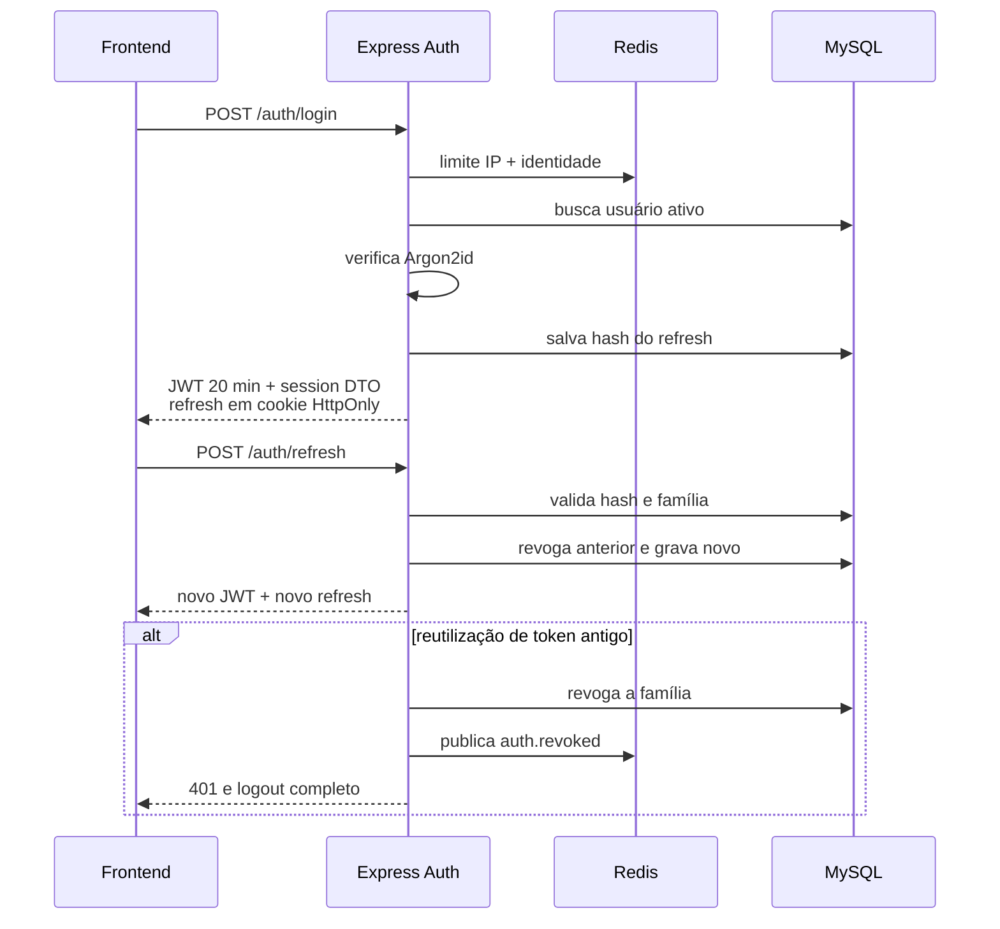

- Access token JWT `RS256` dura 20 minutos e vive apenas na memória do frontend.
- Claims: `sub`, `role`, `authVersion`, `jti`, `iss`, `aud`, `iat`, `exp`.
- O verificador fixa algoritmo, emissor e audiência.
- Refresh token é opaco e aleatório, rotacionado a cada uso; seu hash fica no
  MySQL. O valor fica somente em cookie `Secure`, `HttpOnly`, `SameSite=Strict`.
- O frontend recebe `accessToken`, `expiresIn` e um DTO sanitizado `session`
  com ID, usuário, papel e permissões.
- Logout, troca de senha, alteração de papel ou bloqueio invalidam a sessão.
- MFA fica fora do MVP.

### 9.4 Coexistência com a autenticação legada

- O corte de autenticação acontece antes da promoção do Angular. Nesse corte,
  `connect.sid` é invalidado e há uma única reautenticação controlada.
- Depois dela, Angular e `/legacy` compartilham a mesma família de refresh. O
  legado deixa de criar sessão própria: middleware interno valida o cookie
  `__Host-hubbie.refresh` no Auth Service sem rotacioná-lo e aplica o mesmo RBAC.
- O handshake Socket.IO legado passa pelo mesmo validador; nenhuma conexão é
  aceita apenas por possuir o antigo `connect.sid`.
- Login e refresh emitem o cookie com `Path=/`; logout, bloqueio, troca de senha
  ou reutilização revogam a família, limpam o cookie e encerram sockets dos dois
  frontends.
- Promoção e rollback trocam somente a rota Nginx `/` entre Angular e legado.
  Como ambos já usam a mesma família, rollback não perde sessão. Restaurar o
  autenticador `express-session` antigo é proibido.
- O gate de promoção comprova login, refresh, logout e revogação em `/app`,
  `/legacy` e nos dois handshakes. Antes desse gate o Angular não é promovido.

### 9.5 Rate limiting inicial

| Operação | Limite inicial |
|---|---:|
| Login | 5 tentativas/15 min por IP + identidade |
| Refresh | 10/min por sessão |
| API geral | 120/min por usuário |
| Envio manual | 30/min por usuário |
| Criação de campanha | 5/h por usuário |
| Upload | 10/min e 100 MB/h por usuário |
| Handshake Socket.IO | 10/min por IP + usuário |
| Eventos recebidos | 60/min por conexão |

Respostas usam `429` e `Retry-After`. Se Redis cair, operações sensíveis falham
fechadas; leituras podem usar limite local conservador.

## 10. Socket.IO, WSS e Pub/Sub

Produção aceita somente WSS sobre TLS 1.3 terminado no Nginx. O Redis Adapter é
um transporte interno; Redis não fica exposto e usa ACL/credenciais dedicadas.

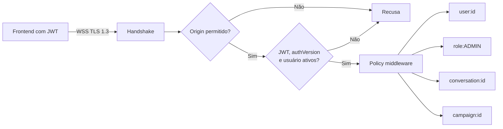

- REST recebe mutações; Socket.IO envia notificações e progresso.
- O servidor calcula salas e revalida acesso; o cliente não escolhe uma sala por
  nome livre.
- `SUPPORT` não entra em salas com conversa, mídia, prompt ou destinatários.
- JWT expirado fecha a conexão; o frontend renova e reconecta.
- Bloqueio e logout desconectam sockets imediatamente.
- Origin allowlist, payload máximo de 64 KB, heartbeat, limites de conexão,
  backpressure e compressão desativada.
- Eventos incluem `eventId`, `occurredAt`, `aggregateId`, `aggregateVersion` e
  `data`; snapshots REST corrigem eventos perdidos após reconexão.
- Autorização por evento/sala não fica no caminho do worker de campanha. A API
  autoriza criação/cancelamento; a fila trabalha independentemente e publica
  somente progresso agregado na sala privada da campanha.
- Pub/Sub não é durável nem fonte da verdade. Eventos são publicados somente
  depois da outbox MySQL confirmar o estado.

Eventos iniciais:

- `whatsapp.status.v1`
- `message.created.v1`
- `message.status.v1`
- `conversation.updated.v1`
- `job.updated.v1`
- `reminder.updated.v1`
- `campaign.progress.v1`
- `contact.block_changed.v1`
- `user.status_changed.v1`

## 11. Filas, ordenação e campanhas

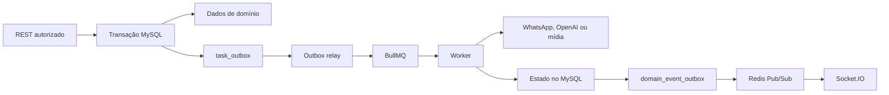

Filas:

- `media-processing`: antivírus, normalização, OCR e transcrição.
- `automation-0..7`: hash estável da conversa com concorrência 1 por lane.
- `outbound`: único ponto autorizado a chamar `sendMessage()`.
- `bulk-dispatch`: próximo destinatário de campanha.
- `reminders`: lembretes vencidos.
- `maintenance`: outbox, exclusões, reconciliação e rotação.

Jobs carregam somente IDs. Estado, conteúdo e tentativas ficam no MySQL.

### 11.1 Ordenação

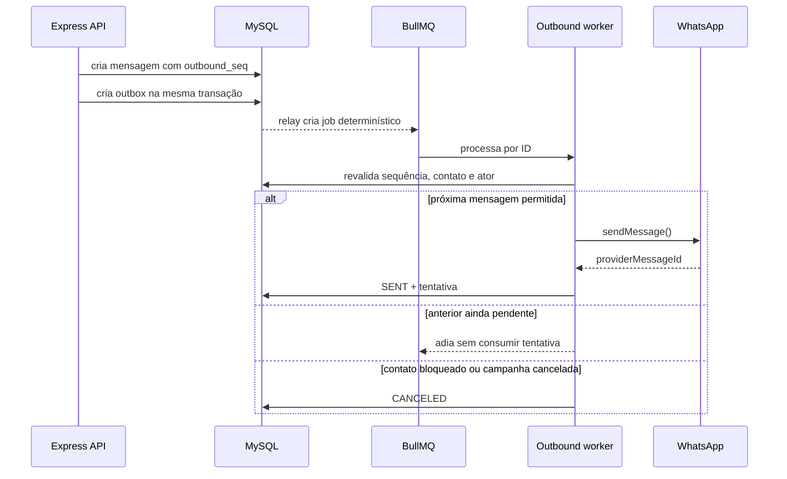

- Sequência monotônica por conversa.
- Manual tem prioridade entre conversas, mas não ultrapassa item anterior da
  mesma conversa.
- Resposta humana posterior invalida IA pendente.
- Bloqueio incrementa `automation_epoch`; IA criada na versão anterior é
  descartada.
- Falha comprovadamente pré-envio recebe até cinco tentativas com backoff
  exponencial e jitter.
- Queda após chamada externa e antes do commit produz `UNKNOWN`.

### 11.2 Campanhas

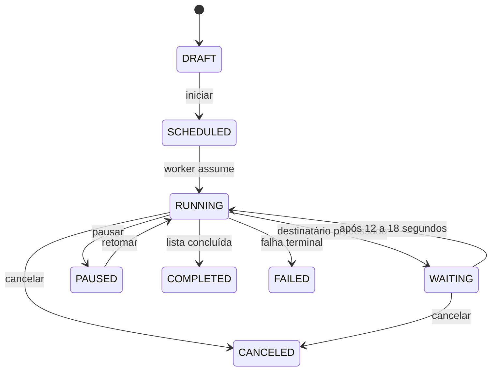

1. Telefones são normalizados em E.164, validados e deduplicados.
2. Um gate global atende todas as campanhas da instalação.
3. Um destinatário de campanha é processado por vez.
4. Antes do efeito externo, uma transação bloqueia o gate, revalida regras,
   reserva o destinatário e avança `next_bulk_send_at` em 12–18 segundos.
5. A mesma transação grava `attempt_phase=PREPARED`; imediatamente antes de
   `sendMessage`, uma segunda transação valida ownership/fencing e grava
   `CALL_STARTED`. Crash em `PREPARED` perde o slot e só reprocessa depois do
   gate; crash em `CALL_STARTED` vira `UNKNOWN`, sem reenvio automático.
6. O próximo job usa `delay`; nenhum worker dorme aguardando o intervalo.
7. Reinício envia no máximo um destinatário vencido e nunca antecipa a reserva
   já persistida nem executa catch-up em rajada.
8. Pausa, cancelamento e bloqueio são verificados na reserva e novamente antes
   de iniciar o efeito externo.
9. Mensagens manuais continuam durante a espera da campanha.
10. `AGENT` e `ADMIN` criam campanhas; `ADMIN` cancela qualquer campanha.
11. Socket.IO só recebe progresso e não influencia o ritmo.

### 11.3 Bloqueios

- `AGENT` e `ADMIN` bloqueiam e desbloqueiam contatos com motivo.
- Bloqueio impede IA, envio manual, lembretes e campanhas.
- Jobs não enviados são cancelados.
- Inbound continua persistido, mas não recebe resposta.
- O contato permanece visível com status de bloqueio.
- `ADMIN` bloqueia/desbloqueia `AGENT`s. Isso incrementa `auth_version`, revoga
  tokens, desconecta sockets e cancela envios pendentes criados pelo usuário.

## 12. Uma sessão WhatsApp e autoria

Cada instalação possui exatamente uma sessão e um número WhatsApp. Todos os
atendentes trabalham na mesma caixa compartilhada.

- Mensagens guardam `sent_by_user_id`, papel e snapshot do nome exibido.
- O painel mostra o nome acima de cada mensagem.
- Mensagem humana enviada ao cliente recebe prefixo `*Nome do atendente:*`.
- Anexos usam o nome na legenda.
- Mensagem automática recebe prefixo `*Assistente:*`.
- Conteúdo original é armazenado separadamente da apresentação, evitando
  prefixos duplicados em retries.
- O worker único é dono de `whatsapp-web.js`, Chromium e `LocalAuth`.

Máquina de estados:

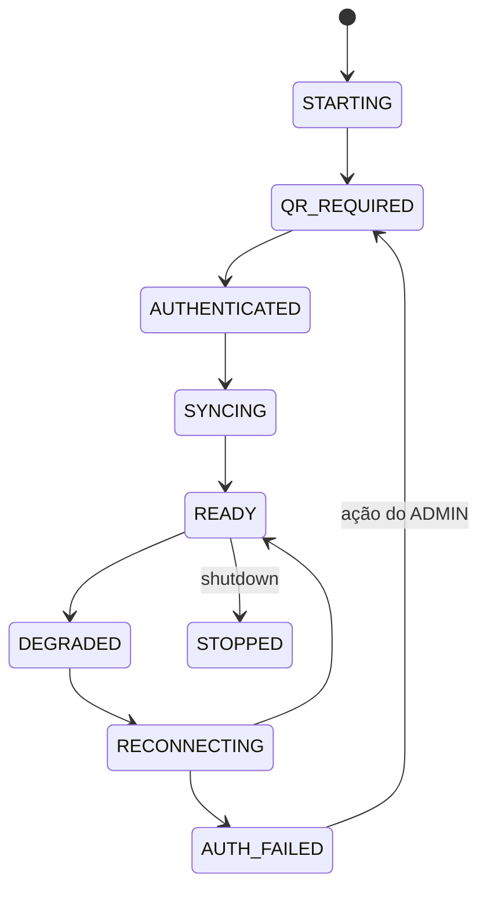

Ownership é autoritativo no MySQL: uma conexão dedicada mantém um advisory lock
por instalação e a linha `whatsapp_session_ownership` contém `owner_instance_id`,
`fencing_token` monotônico, `lease_expires_at` e heartbeat. Redis não decide
ownership. Perda da conexão ou falha de renovação faz o worker parar consumo e
falhar fechado. Cada outbound valida token e lease em transação imediatamente
antes de gravar `CALL_STARTED`; o lease deve cobrir timeout do provider mais
margem. Um novo owner aguarda o lease/grace do envio anterior, transforma
tentativas `CALL_STARTED` órfãs em `UNKNOWN` e só então envia. O worker também
possui backoff com jitter e shutdown gracioso. `AUTH_FAILED` nunca apaga
`LocalAuth` automaticamente.

## 13. Mídia e conteúdo não confiável

Mensagens e mídias permanecem no histórico até exclusão via API. Mídias ficam
criptografadas em filesystem privado; MySQL guarda metadados, hash, referência
opaca e chave envolvida.

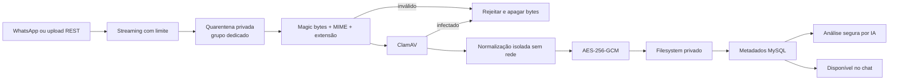

### 13.1 Regras comuns

- Upload por streaming; anexos não trafegam como base64 em JSON/Socket.IO.
- UUID interno, SHA-256 e limites aplicados durante a leitura.
- Nome original serve somente para exibição sanitizada.
- Extensão, MIME, magic bytes e decodificação real devem concordar.
- Arquivos permanecem invisíveis enquanto `QUARANTINED`.
- ClamAV é obrigatório, mas não é tratado como prova única de segurança.
- Parser/normalizador executa sem rede, com filesystem mínimo, timeout, CPU,
  memória e PIDs limitados.
- Apenas derivados `CLEAN` são exibidos ou enviados à IA.
- Download passa por controller autenticado, autorização da conversa,
  `Content-Disposition` seguro e `nosniff`.

### 13.2 Allowlist e limites iniciais

| Categoria | Permitidos | Limites |
|---|---|---|
| Imagem | JPEG, PNG, WebP | 10 MB, 20 MP |
| Áudio | OGG/Opus, MP3, WAV, M4A/AAC | 20 MB, 15 min |
| Documento | PDF, TXT UTF-8 | 20 MB, PDF até 50 páginas |
| Office | XLS, XLSX, DOCX | 20 MB, extração limitada |

- Imagens são recodificadas e perdem EXIF/metadados.
- Áudio é validado com `ffprobe` isolado e transcodificado antes da transcrição.
- PDF rejeita JavaScript, launch actions, anexos, formulários ativos e senha.
- XLS/XLSX extrai somente valores; fórmulas nunca executam.
- DOCX rejeita macros, relacionamentos externos e conteúdo incorporado.
- DOCX/XLSX recebem proteção contra ZIP bomb.
- São rejeitados scripts/executáveis, `.php`, `.bat`, `.cmd`, `.ps1`, `.sh`,
  `.js`, `.exe`, `.dll`, `.msi`, `.jar`, HTML, XML/SVG, compactados, arquivos
  com macros e extensões duplas.
- Formato desconhecido recebe `UNSUPPORTED`, gera alerta no chat e auditoria
  sanitizada, tem seus bytes apagados e mantém somente nome sanitizado, hash e
  tamanho.

### 13.3 Prompt injection e renderização

- Mensagem, OCR, documento e transcrição são dados não confiáveis, nunca
  instruções do sistema.
- O system prompt é versionado e editável apenas com permissão específica.
- A IA não recebe ferramentas de escrita, exclusão, estoque ou envio arbitrário
  no MVP.
- URLs fornecidas em conteúdo não são acessadas.
- Egress dos workers usa allowlist.
- Conteúdo enviado à OpenAI é minimizado e limitado por tokens/custo.
- Saída é renderizada como texto; nunca se usa `innerHTML` com conteúdo não
  confiável ou bypass de sanitização no futuro Angular.

## 14. Exclusão e retenção

- Mensagens e mídias não expiram automaticamente.
- `ADMIN` e `AGENT` podem excluir mensagem ou conversa pela API; `SUPPORT` não.
- Exclusão exige confirmação, motivo, autorização por objeto e idempotência.
- A API retorna `202` com `deletion_job_id` e torna o recurso invisível de
  imediato.
- O job remove ciphertext, mídia, derivados, thumbnail, transcrição, OCR,
  caches e temporários.
- Auditoria preserva somente tombstone sem conteúdo.
- A exclusão não promete apagar cópias já entregues ao WhatsApp/cliente ou
  retidas por fornecedor externo.
- Logs operacionais ficam 30 dias; auditoria sanitizada fica 1 ano.

## 15. Cache-aside

- Namespace `hubbie:{installationUuid}:v1:*`.
- Fluxo: Redis GET → miss → MySQL → SET EX com jitter.
- Configuração e catálogo: 5–15 min.
- Listas e filtros: 30–60 s.
- Janela quente da IA: 2 h e últimas 10 mensagens, sempre reconstruível do
  MySQL.
- Negative cache: 15–30 s.
- Outbox invalida cache somente depois do commit.
- Coleções usam generation/version; não há delete por wildcard.
- Estoque, autorização, claims e bloqueios são revalidados no MySQL em efeitos
  críticos.
- Blacklist pode usar membership cache, mas indisponibilidade consulta MySQL ou
  falha fechada antes de outbound.

## 16. Observabilidade e resiliência

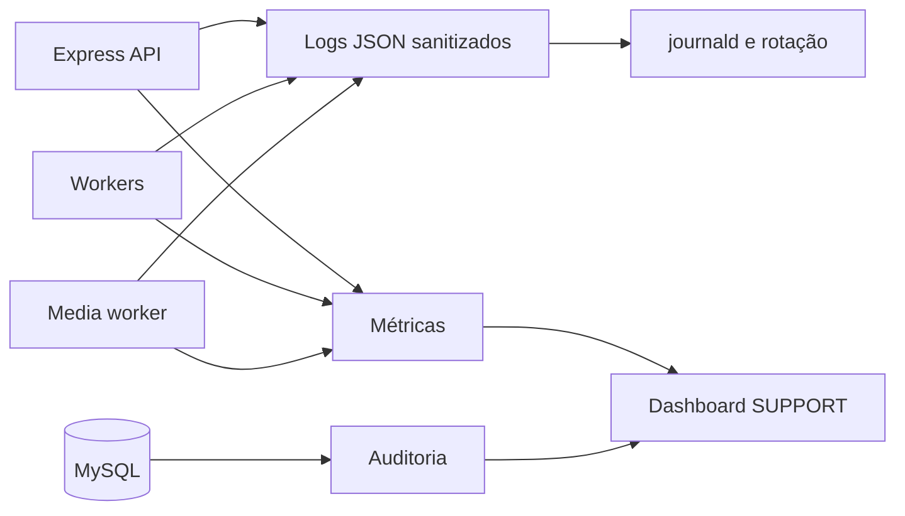

`SUPPORT` observa saúde, métricas, latências, filas, falhas, estado WhatsApp,
ClamAV, disco, migrations e versão. Nunca vê texto, mídia, transcrição, prompt,
nome, telefone completo, token, cookie, segredo, QR ou payload de job.

Logs operacionais contêm somente IDs opacos, `requestId`, `jobId`, duração,
estado e erro classificado. Auditoria registra ator, papel, ação, recurso,
resultado, data, correlação, motivo e hashes redigidos.

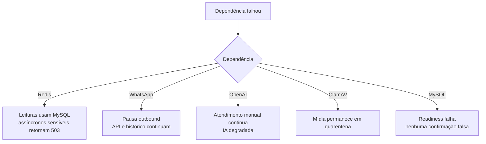

Alertas principais: WhatsApp offline por mais de cinco minutos, heartbeat do
worker maior que 60 s, DLQ/`UNKNOWN` maior que zero, violação de intervalo menor
que 12 s, atraso de lembrete, ClamAV indisponível e disco acima de 85%.

## 17. VPS Linux sem Docker

```text
/opt/hubbie/releases/<commit>
/opt/hubbie/current
/etc/hubbie/credentials/
/var/lib/hubbie/whatsapp/
/var/lib/hubbie/media/
/var/lib/hubbie/quarantine/
```

Serviços:

- `hubbie-legacy.service` durante a migração.
- `hubbie-api.service`.
- `hubbie-worker.service`.
- `hubbie-media-worker.service`.

Nginx é o único processo público. MySQL, Redis, API e métricas escutam em
loopback ou socket Unix. Cada serviço usa usuário próprio, `UMask=0077`,
`NoNewPrivileges`, `PrivateTmp`, filesystem protegido, limites de recursos e
shutdown gracioso. SSH usa chave, login root desativado e firewall restritivo.

Releases ficam em diretórios imutáveis com symlink `current`. Migrations
aditivas precedem o restart. Backups cifrados de MySQL, mídia e `LocalAuth` são
restaurados em ensaio periódico.

## 18. SDD, Git e agentes

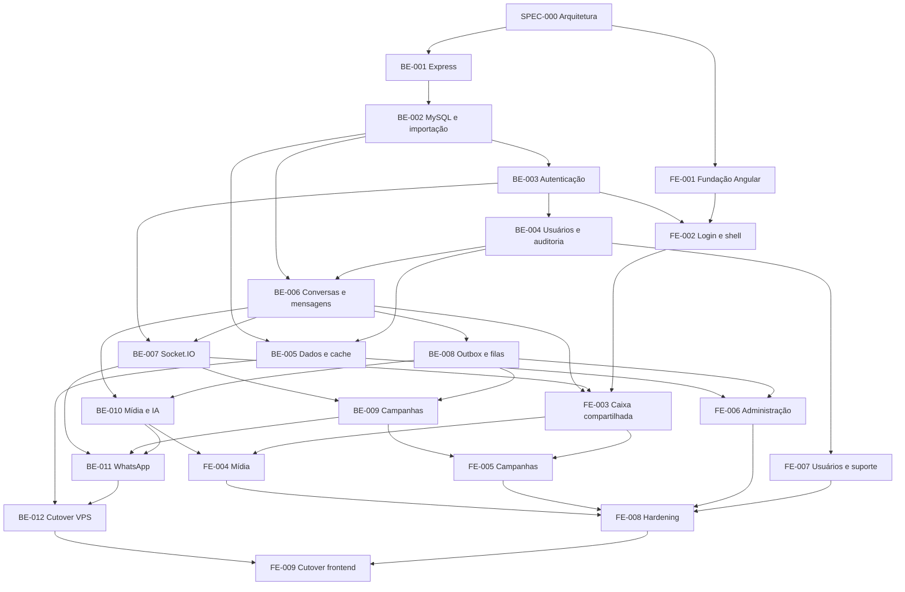

- `main`: produção.
- `dev`: integração; criada em 2026-08-12.
- `feat/spec-NNN-descricao`: branch/worktree isolado por spec.
- Uma spec só entra em implementação após aprovação humana.
- Um agente implementa dentro do escopo e outro revisa diff, segurança e testes.
- Merge em `dev` exige critérios verdes; `main` recebe apenas release validada.

## 19. Critérios de aceitação arquiteturais

| ID | Critério |
|---|---|
| AC-001 | O legado permanece atendendo durante as fatias, exceto reconexão controlada do WhatsApp no corte final. |
| AC-002 | Reexecutar o mesmo importador não duplica nem altera contagens. |
| AC-003 | Duas vendas concorrentes não perdem atualização nem deixam saldo inválido. |
| AC-004 | Flush completo do cache Redis não altera resultados funcionais. |
| AC-005 | Retry de comando idempotente não duplica efeito. |
| AC-006 | Crash em qualquer fase de lembrete/campanha deixa o trabalho recuperável. |
| AC-007 | Nenhum destinatário de campanha é processado antes de 12 s do anterior no gate global. |
| AC-008 | Reinício não causa rajada de campanhas atrasadas. |
| AC-009 | Mensagens da mesma conversa respeitam sequência monotônica. |
| AC-010 | Resultado externo ambíguo vira `UNKNOWN` sem retry automático. |
| AC-011 | Bloqueio de contato impede todos os outbounds ainda não executados. |
| AC-012 | Bloqueio de usuário revoga refresh, invalida JWT por `auth_version` e fecha sockets. |
| AC-013 | `SUPPORT` não obtém conteúdo por REST, Socket.IO, logs, métricas ou jobs. |
| AC-014 | JWT dura 20 minutos e refresh rotacionado reutilizado revoga a família. |
| AC-015 | Cliente não entra em sala sem autorização por objeto calculada no servidor. |
| AC-016 | Arquivo desconhecido/malicioso nunca é exibido, analisado pela IA ou persistido em bytes. |
| AC-017 | Mídia limpa permanece no chat cifrada e só é baixada com autorização. |
| AC-018 | Exclusão torna conteúdo invisível e remove todos os derivados de forma idempotente. |
| AC-019 | Logs e dashboard SUPPORT não contêm mensagem, mídia, prompt, PII ou segredo. |
| AC-020 | Mensagem humana mostra o autor no painel e no WhatsApp; IA mostra `Assistente`. |
| AC-021 | Existe exatamente uma sessão WhatsApp ativa por instalação. |
| AC-022 | O bootstrap não contém senha padrão no Git e força troca de credenciais. |

## 20. Estratégia de testes

- Unitários de Services e regras de estado.
- Integração com MySQL e Redis reais em ambiente de teste.
- Contratos OpenAPI e schemas de eventos/jobs.
- Matriz completa de permissões REST e Socket.IO.
- JWT, bloqueio, rotação e reutilização de refresh.
- Concorrência de estoque e ordering de mensagens.
- Jitter de campanha e propriedade `intervalo >= 12 s`.
- Reinício, job stalled, outbox pendente, DLQ e reconciliação.
- Importação repetida e rollback de fatia.
- Cache miss, flush e indisponibilidade Redis.
- Arquivos infectados, macros, fórmulas, ZIP bombs, extensões duplas e unknown.
- XSS, SQL injection, prompt injection, CSWSH e payload excessivo.
- Smoke test na VPS antes de mudar rotas do Nginx.

Capacidade-alvo inicial: 20 usuários simultâneos, 10 mil contatos, 1 milhão de
mensagens e campanha de até 5 mil destinatários por instalação.

## 21. Rollback

- Cada fatia mantém feature flag e adaptador legado até cumprir seus critérios.
- Falha antes da promoção mantém JSON como autoritativo.
- Durante espelhamento, cada escrita usa chave idempotente e reconciliação.
- Depois da promoção, rollback retorna a leitura ao legado apenas enquanto o
  espelho estiver ativo e validado; não se mistura escrita divergente.
- Migrations destrutivas só ocorrem após retirada do legado e backup restaurado.
- O corte WhatsApp preserva backup cifrado de `LocalAuth` e permite retornar ao
  worker legado se a inicialização nova falhar.

## 22. Riscos residuais aceitos

1. `whatsapp-web.js` é não oficial e pode sofrer mudanças, bloqueio ou logout.
2. Exactly-once não existe para `sendMessage()`; `UNKNOWN` requer operação.
3. Uma VPS concentra banco, aplicação e chaves; comprometimento root é crítico.
4. Parsers, Chromium e ClamAV exigem isolamento e atualização contínuos.
5. Prompt injection não é eliminável; o modelo não recebe autoridade para
   efeitos colaterais.
6. Exclusão não alcança cópia já entregue ao destinatário ou eventualmente
   retida por fornecedor externo.
7. O sender único limita throughput, coerente com uma sessão e com o gate de
   segurança do produto.

## 23. Decisões aprovadas

- Single-tenant por instalação e cobrança fora do MVP.
- Express 5 em JavaScript ESM; NestJS removido por overengineering.
- MVC modular simples, SOLID pragmático e sem hexagonal.
- MySQL fonte da verdade; Redis para cache-aside, BullMQ e Pub/Sub.
- Socket.IO em WSS/TLS 1.3 e autorização por handshake, evento e sala.
- JWT 20 min, refresh rotativo em cookie HttpOnly e session DTO no frontend.
- Seed seguro do primeiro `ADMIN`; MFA adiado.
- `ADMIN`, múltiplos `AGENT`s e `SUPPORT` somente observabilidade.
- Uma única sessão/número WhatsApp e caixa compartilhada.
- Autor humano e `Assistente` visíveis no painel e no texto do WhatsApp.
- `AGENT` bloqueia/desbloqueia contatos e cria campanhas.
- `ADMIN` bloqueia/desbloqueia agentes e cancela qualquer campanha.
- Gate global de campanhas entre 12 e 18 segundos.
- Mensagens/mídias persistem até exclusão por `ADMIN` ou `AGENT`.
- PDF, TXT, XLS, XLSX, DOCX, imagens e áudios permitidos sob pipeline seguro.
- Formato desconhecido gera alerta e tem bytes removidos.
- Logs por 30 dias; auditoria sanitizada por 1 ano.
- Strangler Fig preserva o legado; corte WhatsApp aceita reconexão breve.
- Angular é a View do MVC e será implementado depois do backend estabilizado.

## 24. Referências primárias

- [Express 5 — migração e tratamento assíncrono](https://expressjs.com/en/guide/migrating-5/)
- [Express — middleware](https://expressjs.com/en/5x/guide/using-middleware/)
- [TypeORM — MySQL](https://typeorm.io/docs/drivers/mysql/)
- [BullMQ — delayed jobs](https://docs.bullmq.io/guide/jobs/delayed)
- [BullMQ — retries](https://docs.bullmq.io/guide/retrying-failing-jobs)
- [Socket.IO — Redis Adapter](https://socket.io/docs/v4/redis-adapter/)
- [Socket.IO — middleware](https://socket.io/docs/v4/middlewares/)
- [RFC 8725 — JWT Best Current Practices](https://www.rfc-editor.org/info/rfc8725/)
- [OWASP — WebSocket Security](https://cheatsheetseries.owasp.org/cheatsheets/WebSocket_Security_Cheat_Sheet.html)
- [OWASP — Cryptographic Storage](https://cheatsheetseries.owasp.org/cheatsheets/Cryptographic_Storage_Cheat_Sheet.html)
- [OWASP — Password Storage](https://cheatsheetseries.owasp.org/cheatsheets/Password_Storage_Cheat_Sheet.html)
