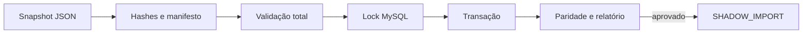

# BE-002 — MySQL, criptografia e importação JSON

- **Estado:** DRAFT
- **Design pai:** [SPEC-000](../SPEC-000-arquitetura-migracao.md)
- **Depende de:** BE-001

## Objetivo

Disponibilizar schema MySQL versionado, primitivas criptográficas e importador
idempotente dos seis JSONs, sem promover o banco a fonte autoritativa.

## Escopo

- TypeORM DataSource/MySQL 8 com `synchronize: false`.
- Migrations das tabelas aprovadas no modelo da SPEC-000.
- AES-256-GCM, blind index HMAC-SHA-256, `key_version` e envelope de mídia.
- Importador de `estoque`, `config`, `tags`, `cores`, `fixados`, `arquivadas`.
- Manifesto/hashes, validação completa, lock, transação e relatório de paridade.
- Seed idempotente do primeiro `ADMIN` com credencial externa; detalhes de troca
  serão ativados por BE-003.

## Requisitos

- **BE002-R01:** o mesmo manifesto executado duas vezes é no-op.
- **BE002-R02:** erro em qualquer arquivo impede commit de toda a importação.
- **BE002-R03:** preço pt-BR vira `DECIMAL`, validade ausente vira `NULL`.
- **BE002-R04:** chaves criptográficas nunca ficam no MySQL ou Git.
- **BE002-R05:** criptografia detecta alteração de ciphertext/AAD.
- **BE002-R06:** migrations possuem caminho de rollback seguro enquanto vazio.

## Fluxo



## Cenários de aceite

```gherkin
Given um snapshot válido já importado
When o importador recebe o mesmo manifesto
Then nenhuma linha ou movimento é duplicado

Given preço, data ou JSON inválido
When a validação é executada
Then nenhuma alteração é persistida e o erro identifica arquivo/campo sem valor sensível

Given ciphertext ou AAD alterado
When o serviço tenta descriptografar
Then a operação falha fechada e gera alerta sanitizado
```

## Testes obrigatórios

Integração MySQL real, migrations up/down, fixtures dos JSONs atuais, property
tests de round-trip criptográfico, adulteração, rotação e importação concorrente.

## Rollout e rollback

Executar em shadow, comparar contagens/checksums e não trocar leitores. Rollback
remove somente schema/linhas novas depois de snapshot confirmado.
