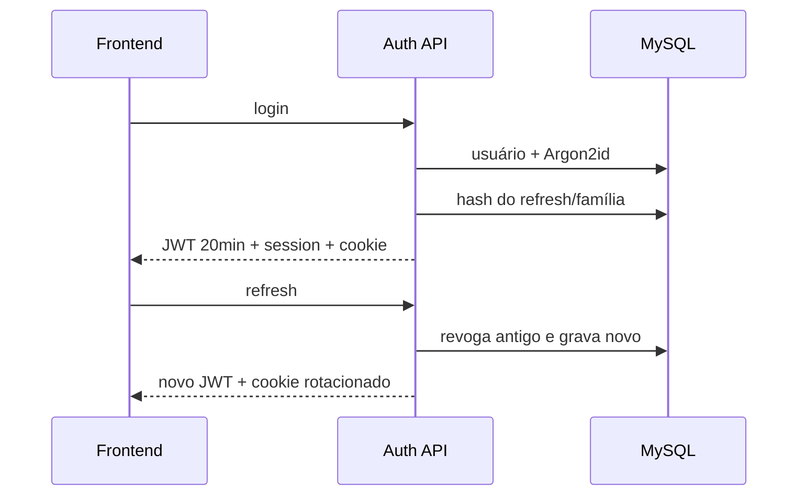

# BE-003 — Autenticação JWT e refresh

- **Estado:** DRAFT
- **Design pai:** [SPEC-000](../SPEC-000-arquitetura-migracao.md)
- **Depende de:** BE-001, BE-002

## Objetivo

Implementar login local, access JWT de 20 minutos, refresh rotativo, bootstrap
seguro e sessão sanitizada para o frontend.

## Contrato mínimo

- `POST /api/v1/auth/login`
- `POST /api/v1/auth/refresh`
- `POST /api/v1/auth/logout`
- `GET /api/v1/auth/session`
- `POST /api/v1/auth/change-initial-credentials`

Login/refresh retornam `accessToken`, `expiresIn: 1200` e `session`. O refresh
opaco fica somente no cookie `Secure`, `HttpOnly`, `SameSite=Strict`.

## Requisitos

- **BE003-R01:** senha é Argon2id calibrado na VPS.
- **BE003-R02:** JWT aceita apenas RS256 e valida `iss`, `aud`, `exp`, `jti`.
- **BE003-R03:** refresh é armazenado apenas por hash e rotacionado a cada uso.
- **BE003-R04:** reutilização revoga toda a família e publica `auth.revoked`.
- **BE003-R05:** `auth_version` invalida access tokens anteriores.
- **BE003-R06:** primeiro ADMIN não acessa domínio antes de trocar credenciais.
- **BE003-R07:** login e refresh têm rate limit distribuído e auditoria.
- **BE003-R08:** após o corte de auth, `/legacy` e Angular validam a mesma família
  de refresh; `connect.sid` antigo nunca concede acesso.
- **BE003-R09:** logout/revogação encerram REST e Socket.IO nos dois frontends.

## Sequência



## Cenários de aceite

```gherkin
Given a credencial temporária do seed
When o ADMIN autentica
Then somente troca inicial e logout são permitidos

Given um refresh já rotacionado
When ele é reutilizado
Then toda a família é revogada e as conexões são encerradas

Given cinco falhas para a mesma identidade e IP
When nova tentativa ocorre dentro de 15 minutos
Then a API responde 429 com Retry-After sem revelar existência da conta
```

## Testes obrigatórios

Unitários de tokens/cookies, integração de rotação e concorrência de refresh,
alg confusion, expiração, `auth_version`, enumeração e rate limit.

## Rollout e rollback

O corte invalida `connect.sid` e exige uma reautenticação controlada. A partir
daí, middleware interno do legado valida `__Host-hubbie.refresh` no Auth Service
sem rotacionar e usa o mesmo RBAC/`auth_version`; Socket.IO faz o mesmo. Promoção
e rollback trocam apenas a rota Nginx, preservando o refresh. Restaurar
`express-session` é proibido.
