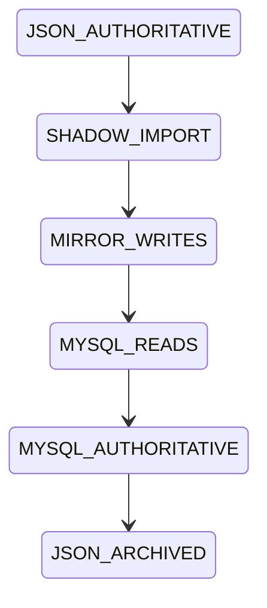

# BE-005 — Dados legados e cache-aside

- **Estado:** DRAFT
- **Design pai:** [SPEC-000](../SPEC-000-arquitetura-migracao.md)
- **Depende de:** BE-002, BE-004

## Objetivo

Migrar APIs de estoque, configurações, tags, cores, fixados, arquivados e
bloqueios, promovendo MySQL por fatia com cache-aside e adaptadores do legado.

## Escopo

- APIs REST OpenAPI para recursos legados.
- Transações/ledger de estoque e optimistic locking.
- Tags/cores por contato, preferências fixadas por usuário e arquivamento.
- IA global e prompt cifrado/versionado.
- Bloqueio/desbloqueio de contatos por `AGENT`/`ADMIN`, com motivo.
- Redis cache-aside, TTL com jitter, generation keys e outbox de invalidação.
- Adaptadores de `index.js` e feature flags por recurso.

## Requisitos

- **BE005-R01:** JSON continua autoritativo até a flag da fatia ser promovida.
- **BE005-R02:** duas vendas concorrentes preservam saldo e ledger.
- **BE005-R03:** flush do Redis não altera resposta funcional.
- **BE005-R04:** nenhuma chave Redis contém telefone em claro.
- **BE005-R05:** retries de set/archive/pin/block são idempotentes.
- **BE005-R06:** bloqueio impede outbound, mas mantém inbound no histórico.

## Migração por recurso



## Cenários de aceite

```gherkin
Given Redis vazio ou indisponível
When um recurso é lido
Then MySQL fornece o valor correto e o cache é reconstruído quando possível

Given duas baixas concorrentes no mesmo produto
When ambas confirmam
Then o saldo final equivale à soma e existem dois movimentos auditados

Given um contato bloqueado
When qualquer outbound é preparado
Then ele é cancelado antes do efeito externo
```

## Testes obrigatórios

Integração MySQL/Redis, concorrência, cache stampede básico, outbox/invalidação,
paridade JSON e rollback de cada feature flag.

## Rollout e rollback

Promover um recurso por vez. O espelho temporário usa idempotency key. Rollback
é permitido somente enquanto reconciliação comprovar que o JSON está alinhado.
