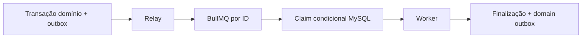

# BE-008 — Outbox, BullMQ e lembretes

- **Estado:** DRAFT
- **Design pai:** [SPEC-000](../SPEC-000-arquitetura-migracao.md)
- **Depende de:** BE-002, BE-006

## Objetivo

Implementar execução assíncrona reconstruível, transactional outbox, workers e
lembretes persistentes sem RabbitMQ/Kafka.

## Escopo

- `task_outbox`, `async_jobs`, leases, tentativas e DLQ lógica no MySQL.
- Relay idempotente para BullMQ com `jobId` determinístico.
- Filas `outbound`, `automation-0..7`, `reminders` e `maintenance`.
- Scheduler/reconciliador e recuperação de jobs stalled/reinício.
- CRUD/cancelamento de lembretes em UTC.
- Retry somente para falha seguramente pré-efeito; backoff exponencial+jitter.

## Requisitos

- **BE008-R01:** job contém IDs opacos, nunca conteúdo sensível.
- **BE008-R02:** commit de domínio sempre deixa outbox recuperável.
- **BE008-R03:** mesmo outbox/job repetido não duplica efeito interno.
- **BE008-R04:** lembrete cancelado/bloqueado é revalidado antes do outbound.
- **BE008-R05:** crash em claim/process/finalize deixa estado reconciliável.
- **BE008-R06:** indisponibilidade WhatsApp adia e não consome tentativa.

## Fluxo



## Cenários de aceite

```gherkin
Given commit concluído e Redis indisponível
When Redis retorna
Then o relay publica exatamente um job lógico

Given worker cai após claim antes do efeito
When o lease expira
Then o reconciliador torna o job elegível novamente

Given lembrete vencido para contato bloqueado
When o worker revalida o envio
Then marca CANCELED e não chama WhatsApp
```

## Testes obrigatórios

Fault injection em cada transição, relay duplicado, stalled jobs, relógio UTC,
cancelamento concorrente, DLQ e graceful shutdown.

## Rollout e rollback

Filas novas iniciam pausadas; reconciliador em dry-run comprova paridade antes
de consumers processarem efeitos.
