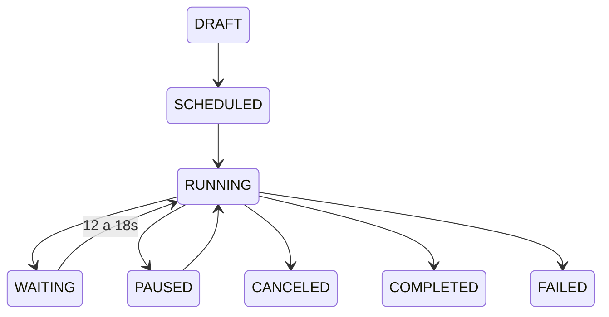

# BE-009 — Campanhas e gate de disparo

- **Estado:** DRAFT
- **Design pai:** [SPEC-000](../SPEC-000-arquitetura-migracao.md)
- **Depende de:** BE-007, BE-008

## Objetivo

Criar campanhas persistentes, pausáveis/canceláveis, com progresso individual e
intervalo global aleatório nunca inferior a 12 segundos.

## Escopo

- CRUD/início/pausa/retomada/cancelamento de campanhas.
- Destinatários de contatos e números estruturados, E.164 e deduplicação.
- Gate global por instalação, `next_bulk_send_at` e um destinatário por job.
- Jitter uniforme de 12–18 segundos após cada tentativa externa real.
- Progresso agregado via `campaign.progress.v1`.
- Revalidação de campanha, contato, bloqueio e sessão WhatsApp antes do envio.

## Requisitos

- **BE009-R01:** nenhum intervalo real entre tentativas de bulk é menor que 12 s.
- **BE009-R02:** reinício não faz catch-up em rajada.
- **BE009-R03:** várias campanhas compartilham o mesmo gate global.
- **BE009-R04:** `AGENT`/`ADMIN` criam; `ADMIN` cancela qualquer campanha.
- **BE009-R05:** mensagens manuais continuam enquanto bulk aguarda.
- **BE009-R06:** Socket.IO não inicia diretamente destinatário ou delay.

## Máquina de estados



## Cenários de aceite

```gherkin
Given duas campanhas simultâneas
When ambas possuem destinatários elegíveis
Then somente uma tentativa bulk ocorre por vez e ambas respeitam o gate comum

Given processo reiniciado com destinatários atrasados
When o worker volta
Then processa no máximo um e agenda novo intervalo antes do próximo

Given contato bloqueado durante WAITING
When seu job fica elegível
Then o destinatário é CANCELED sem efeito externo
```

## Testes obrigatórios

Relógio controlado/property test de jitter, concorrência multi-campanha,
reinício, pause/cancel race, deduplicação E.164 e progresso sanitizado.

## Rollout e rollback

Começar com campanha interna curta e gate observável. Feature flag retorna o
painel ao disparo legado sem mover campanhas já iniciadas entre engines.
