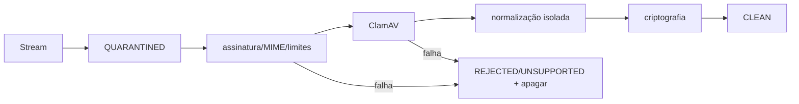

# BE-010 — Mídia segura e IA

- **Estado:** DRAFT
- **Design pai:** [SPEC-000](../SPEC-000-arquitetura-migracao.md)
- **Depende de:** BE-006, BE-008

## Objetivo

Persistir e analisar imagens, áudio e documentos com quarentena, isolamento,
criptografia e controles contra malware, injection e prompt injection.

## Escopo

- Streaming para quarentena privada, UUID, SHA-256 e limites.
- Magic bytes/MIME/extensão, ClamAV e normalizadores sem rede.
- JPEG/PNG/WebP; OGG/MP3/WAV/M4A; PDF/TXT; XLS/XLSX/DOCX.
- Rejeição de macros, fórmulas executáveis, links externos, objetos, ZIP bombs,
  scripts, executáveis, dupla extensão e tipos fora da allowlist.
- DEK por arquivo, KEK externa, download autorizado e expurgo.
- OCR/transcrição/extração delimitados como conteúdo não confiável.
- OpenAI com egress allowlist, limites, circuit breaker e sem ferramentas de
  efeito colateral.

## Requisitos

- **BE010-R01:** somente `CLEAN` pode ser exibido ou enviado à IA.
- **BE010-R02:** unknown/infectado tem bytes apagados e alerta sanitizado.
- **BE010-R03:** arquivo não trafega como base64 em JSON/Socket.IO.
- **BE010-R04:** SUPPORT nunca vê thumbnail, nome, transcrição ou conteúdo.
- **BE010-R05:** queda ClamAV mantém objeto em quarentena.
- **BE010-R06:** exclusão remove original, derivados, OCR/transcrição e chave.

## Pipeline



## Cenários de aceite

```gherkin
Given XLSX com macro, vínculo externo ou ZIP bomb
When o media-worker valida
Then rejeita antes da extração e não envia conteúdo à IA

Given formato desconhecido
When recebido
Then apaga bytes, conserva hash/nome sanitizado/tamanho e publica alerta

Given mídia limpa de conversa não autorizada
When outro usuário solicita download
Then responde 403 sem expor caminho físico
```

## Testes obrigatórios

Corpus malicioso, MIME mismatch, polyglot, bombs, AV indisponível, timeouts,
round-trip cifrado, autorização e prompt-injection fixtures.

## Rollout e rollback

Ativar por tipo de mídia. Falha desativa análise, não a conversa textual. Nenhum
arquivo migra de quarentena para storage sem versão do pipeline registrada.
